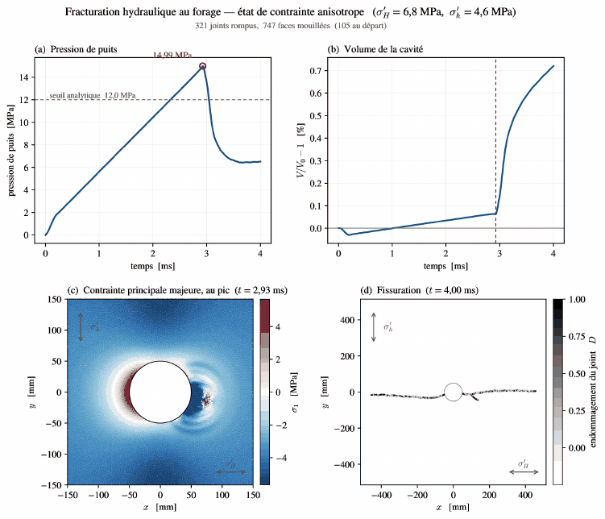
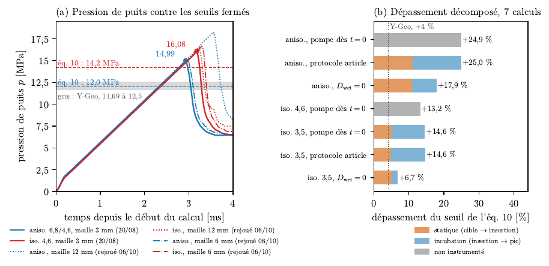

# bench_abuaisha : fracturation hydraulique en paroi de forage (AbuAisha et al. 2017)

## 1. Objet

Reproduction du banc de fracturation hydraulique d'AbuAisha, Eaton, Priest et Wong, « Hydro-mechanically coupled FDEM framework to investigate near-wellbore hydraulic fracturing in homogeneous and fractured rock formations », J. Petrol. Sci. Eng. 154 (2017) 100-113, code Y-Geo. Un forage de 0,1 m dans un granite à 1 800 m est pressurisé par une pompe à débit constant.

Question : le couplage hydromécanique de rockim (pression uniforme dans la cavité connectée, écrit d'après l'article) est-il juste, et retrouve-t-il la pression de rupture et le faciès de l'article ?

L'architecture mécanique est celle de rockim : triangles de Delaunay élastiques, joints cohésifs, mode I de Hillerborg, mode II en glissement adoucissant, couplage mixte elliptique (leur éq. 3). Le module hydraulique reprend l'hypothèse d'un fluide non visqueux de leur annexe A.

## 2. Statut

| date | état |
|---|---|
| 18-22 août 2026 | calculs de production (maillage 3 mm), après le correctif de signe du 20 août |
| 6 octobre 2026 | rejeu partiel avec le binaire `f0209ef` : contrôle de signe, fissure de Parker sur maillage grossier, pressions de rupture à 12 et 6 mm |
| 7 octobre 2026 | non rejoué avec les clés du contact corrigé |

Étude terminée. Ce qui reste valable après les correctifs récents :

- les contrôles élastiques et de volume (Lamé, Sneddon, Parker, croisement de volume, front mouillé) ne dépendent pas du contact entre fragments ;
- la correction du contact du 7 octobre (`docs/rapport_guide/ENQUETE_CONTACT.md`) est une option désactivée par défaut ; ces calculs n'ont pas été rejoués avec elle, si bien que la phase post-pic, où les blocs se touchent, reste à reprendre ;
- le résidu du bilan d'énergie de ces calculs (2,5 à 10,5 %) dépasse le critère de 1 % du rapport ; la pression de rupture est donnée sans contrôle énergétique au pic.

## 3. Résultat principal

- Couplage vérifié sans réglage : paroi sous 12 MPa à −2,0 % de Lamé par deux chemins identiques au bit près, croisement de volume à moins de 0,7 % sur trois états in situ, ouverture de fissure mûre à −4 % de Sneddon (89,0 contre 92,7 µm), fissure de Parker à −5,65 % sur maillage grossier (`VALIDATION_hydro.md` §3 ; rapport-guide, tableau `tab-ab-controles`).
- Pression de rupture surestimée de +6,7 à +25,0 % selon le cas : anisotrope 14,993 MPa contre 12,00 (+24,9 %), isotrope 16,078 contre 14,20 (+13,2 %) ; Y-Geo est à +4 % ou −2,6 % selon la lecture (`VALIDATION_hydro.md` §7).
- Le dépassement se partage entre une part statique (échantillonnage de la contrainte de paroi, qui dépend de la maille) et une incubation commandée par le critère de mouillage : mouiller tout joint inséré (`hydroWetDamage = 0`) fait tomber l'incubation isotrope de 1,137 à 0,171 MPa.
- Faciès conforme : deux ailes sur σ'_H en anisotrope (321 joints rompus, 456 mm à 4 ms), étoile radiale en isotrope.

## 4. Figures



Cas anisotrope : pression de puits (pic 14,99 MPa pour un seuil analytique de 12,0 MPa), volume de cavité, contrainte au pic et fissuration à 4 ms en deux ailes sur σ'_H.



(a) Pression de puits des calculs d'août et des rejeux du 6 octobre à 12 et 6 mm ; (b) dépassement du seuil des sept calculs, part statique et incubation.

Aperçus convertis depuis `docs/rapport_guide/figures/abuaisha/fig_b2_aniso.pdf` et `fig_abuaisha_pression.pdf`.

## 5. Contenu du dossier

| chemin | contenu |
|---|---|
| `VALIDATION_hydro.md` | statut de validation du couplage au 22 août : correctif de signe, contrôles chiffrés, hypothèses, points ouverts, campagne d'essais 1 à 3 |
| `configs/parker*.cfg` | B1, fissure de Parker sous pression uniforme (production et versions grossières `_c`) |
| `configs/hf_iso*.cfg`, `configs/hf_aniso*.cfg` | B2 à B4, forage isotrope et anisotrope ; `_smoke`, `_c` (grossier), `_hydro` (pompe), `_s` (signe corrigé le 20 août, T porté à 4 ms) |
| `configs/e1_*.cfg`, `e2_*.cfg`, `e3_*.cfg` | essais 1 à 3 de la campagne (cible ramenée à 12 MPa, mouillage à D = 0, protocole de l'article) |
| `configs/f7_*.cfg` | faciès à l'amorçage (leur figure 7), par rampe de pression |
| `configs/signe_conf.cfg`, `signe_hydro.cfg` | contrôle de signe (dix secondes chacun) |
| `tools/make_crack_mesh.py` | maillage à lèvres dédoublées pour Parker |
| `tools/parker_check.py`, `parker_compare.py` | ouverture contre la solution de Parker |
| `tools/hydro_sign_check.py` | contrôle du signe de la pression |
| `tools/fig_*.py`, `gif_b2.py` | figures et animation |
| `verify_i1_2026-08-21.log`, `verify_i1_2d_2026-08-22.log` | suite de non-régression, 19/19 |

## 6. Rejouer

Les maillages sont générés, pas versionnés. Depuis la racine du dépôt, avec le binaire `build/rockim` :

```sh
# B1, Parker (maillage de production hFine = 0,003 ; version grossière : 0,012)
python3 bench_abuaisha/tools/make_crack_mesh.py 8.0 8.0 1.5 0.003 0.3 meshes/parker_crack.msh 1
build/rockim bench_abuaisha/configs/parker.cfg out_parker
python3 bench_abuaisha/tools/parker_check.py out_parker

# B2 à B4, forage (outil de maillage de l'étude tunnel)
python3 tunnel_edz/tools/make_circle_mesh.py 8.0 8.0 0.05 0.003 0.4 0.3 meshes/hf_bore.msh 1
build/rockim bench_abuaisha/configs/hf_aniso.cfg out_hf_aniso
build/rockim bench_abuaisha/configs/hf_iso.cfg out_hf_iso
```

Versions grossières pour dégrossir (hFine = 0,012) : `parker_crack_c.msh` (22 444 triangles) et `hf_bore_c.msh` (12 581 triangles, 26 éléments sur le pourtour). Les maillages de production visent environ 105 éléments sur le pourtour, comme l'article. Les maillages grossiers du rejeu du 6 octobre sont dans `docs/rapport_guide/simulations_a_lancer/meshes/`.

Chapitre du rapport-guide : `docs/rapport_guide/sections/r05b_abuaisha.tex`, dans [rapport_guide_rockim.pdf](../docs/rapport_guide/rapport_guide_rockim.pdf).

## Annexe : notes du README d'origine (19-22 août 2026)

### Les cinq essais reproductibles sans écoulement

Ce qui manquait à rockim au départ était le fluide : calculateur de volume de cavité, compressibilité, pompe. La conséquence, écrite dans le source (`confineFaces = bore`) : « faces born from cracking receive nothing ». Sans module hydraulique, la pression ne suit pas la fissure ; tout ce qui se joue avant l'amorçage, ou sous pression imposée, reste reproductible. Le module hydraulique a été ajouté ensuite (`VALIDATION_hydro.md`).

| essai | figure de l'article | mesure | cible |
|---|---|---|---|
| B1 | A.20 / A.21 | ouverture d'une discontinuité sous pression uniforme | Parker (1981), éq. A.1 : w(0) = 0,0640 mm |
| B2 | 11, branche montante et pic | pression de rupture | 12 MPa anisotrope (leur éq. 10), environ 12,5 MPa leur numérique ; 14,2 MPa isotrope |
| B3 | 9, panneau « no defects » | champ de contrainte avant amorçage | Kirsch avec pression interne (`tunnel_edz/tools/kirsch_check.py`) |
| B4 | 7, t = 1,2 ms | faciès à l'amorçage | étoile radiale (isotrope), bi-aile sur σ_H (anisotrope) |
| B5 | 11 avec joints, pic seul | décalage du seuil dû au joint préexistant | +5,2 % joints longitudinal et oblique, environ 0 % transverse |

B1 est le seul point de l'article confronté à une solution fermée ; il est sans écoulement par construction (pression uniforme, résistances « irreal high »). B5 est reproductible parce que le décalage de seuil vient de la perturbation du champ de contrainte par le joint, avant l'amorçage.

Hors de portée sans écoulement : le plateau post-pic à 5,5 MPa, le branchement et l'incurvation des figures 7 et 10, l'interaction fissure-joint des figures 12, 13 et 15, l'essai de terrain Montney de la figure 19. La microsismicité des figures 16-17 est un post-traitement (leurs éq. 11-13), mais le semis d'événements suit le trajet de fracture et ne coïncidera pas au-delà de l'amorçage.

### Longueur cohésive

ℓ_cz = E·G_Ic/ft² = 35 GPa × 10 / (5 MPa)² = 14 mm, pour une maille de 3 mm et un forage de 100 mm : 2 dx = 6 mm < ℓ_cz = 14 mm < 100 mm. La règle maison est respectée des deux côtés, contrairement à la coupe de Heilman (ℓ_cz = 65 mm pour une passe de 1 mm).

### Points techniques

- Dédoublement des lèvres : une discontinuité d'épaisseur nulle ne peut pas être une fente découpée (ouverture attendue 0,065 mm pour une maille de 3 mm). `make_crack_mesh.py` maille le bloc plein avec la ligne imposée comme contrainte interne, puis dédouble ses nœuds avec le greffon `Crack` de gmsh. Les lèvres deviennent des faces extérieures confondues à t = 0, sans joint, et `confineFaces = bore` les sélectionne seules.
- Contrainte nette en B1 : l'article pose σ_h = 15, σ_v = 10 MPa et p = 12 MPa ; la solution ne dépend que de σ' = p − σ_n = 2 MPa. On applique 2 MPa dans un milieu non précontraint : même ouverture, et pas de lèvres plaquées à t = 0.
- Nomenclature : leur σ_H est la contrainte longitudinale (x), leur σ_h la transversale (y). La clé rockim `insituSh` désigne l'horizontale (x). Donc `insituSh` reçoit leur σ_H et `insituSv` leur σ_h.
- Coquille de l'article : l'annexe A écrit « E = 45 MPa » ; c'est 45 GPa (w(0) = 2 × 2e6 × 0,96 × 0,75 / E et leur figure A.21 lit 0,065 mm, d'où E = 44,3 GPa).
- Réserve sur B2 : rockim ne sait pas retarder la rampe de confinement, qui démarre à t = 0 avec l'excavation. Celle-ci est bouclée à 0,2 ms, quand la paroi ne porte que 1,2 MPa (10 % du seuil visé). L'essai 3 (protocole de l'article) a montré que le pic n'en dépend pas (0,04 %).
