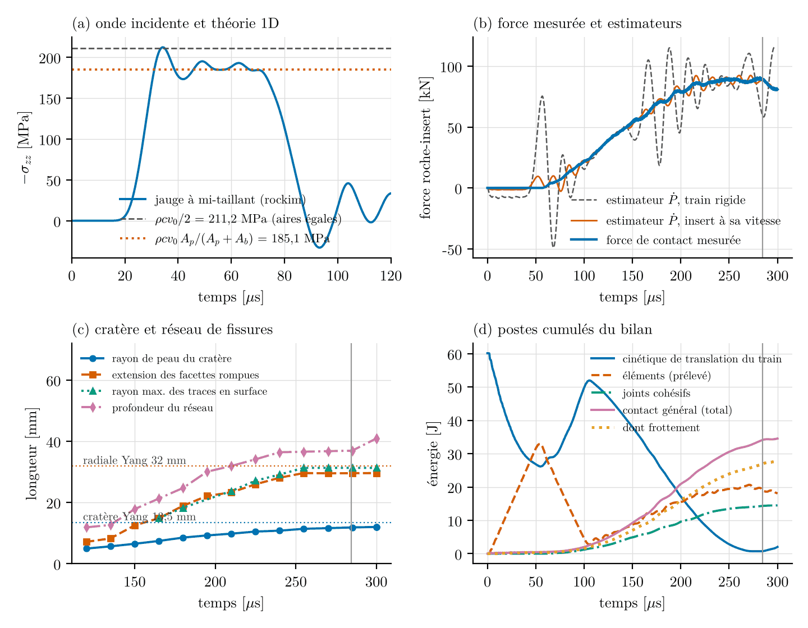
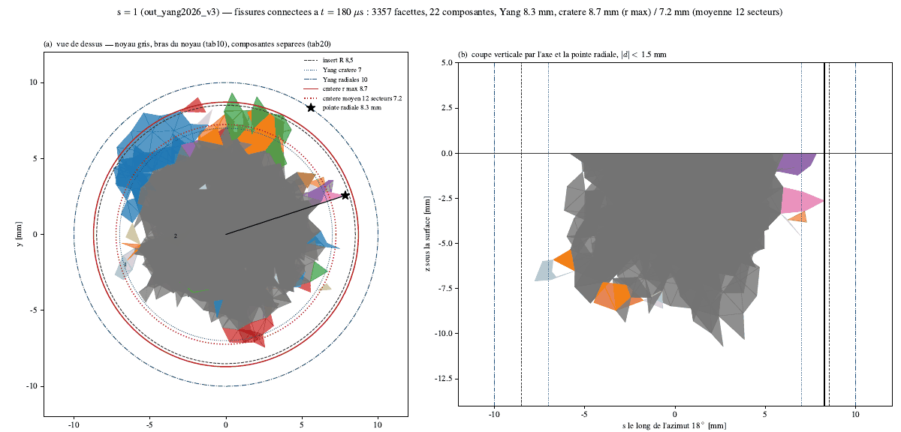

# bench_impact : impact d'un insert unique (Yang et al. 2025 et 2026)

## 1. Objet

Banc d'impact d'un insert de carbure sur la roche, monté comme le banc de Mines Paris-PSL (piston, taillant, insert brasé, circlip, plaque, roche), spécification 005. Références : Yang, Xiang, Naderi, Wang, Aising, Ugarte, Latham, IJRMMS 191 (2025) 106125 (calcaire de St Anne, sept critères de leur Table 3) et IJRMMS 206 (2026) 106660 (granite de Kuru, pulvérisation). Données d'essai : Mines Paris-PSL.

Question : à lois cohésives identiques à celles de Yang et al., rockim retrouve-t-il la vitesse d'indentation, l'enfoncement, le cratère et l'étoile de fissures radiales ? La seule différence conservée est le schéma d'insertion (adaptatif chez rockim, intrinsèque chez Yang).

## 2. Statut

| date | état |
|---|---|
| 22 août 2026 | campagne St Anne à l'échelle de maille 1,5 : trois calculs, pas d'étoile radiale (`BILAN_fissures_radiales.md`) |
| 30 août - 12 septembre 2026 | réplique Kuru (`impact_kuru9*.cfg`), calcul fin arrêté à 182,9 µs |
| 13-14 septembre 2026 | réplique St Anne du rapport-guide (binaire `rockim_g1y19.exe`, configuration archivée avec le calcul, hors de ce dossier) |
| 7 octobre 2026 | aucun calcul d'impact rejoué avec le contact corrigé |

Archive de travail. Les chiffres qui font foi sont ceux du chapitre 6 du rapport-guide. Ce qui reste valable :

- le transfert de l'onde dans le train (plateau de jauge à 0,2 % de la théorie unidimensionnelle) ne dépend pas du contact entre fragments ;
- la correction du contact du 7 octobre (`docs/rapport_guide/ENQUETE_CONTACT.md`) est optionnelle et n'a pas été appliquée à ces calculs ; dans la réplique St Anne, le contact général cumule environ 34 J en fin de charge (figure ci-dessous, panneau d), donc les grandeurs post-rupture (cratère, fragments) restent à confirmer avec le contact corrigé ;
- les chiffres du 22 août (tableau du `BILAN`) sont antérieurs à la correction de `jointNormalProxy` et au cliquet de décharge ; ils ne sont plus comparables à la réplique de septembre.

## 3. Résultat principal

- St Anne à 300 µs (rapport-guide, tableau `tab-stanne`) : contrainte au taillant 212,3 MPa (+6 %), vitesse d'indentation 7,08 à 7,34 m/s (−8 à −12 %), rayon du cratère 12,00 mm (−11 %), enfoncement 1,292 mm (+17 %), masse de fragments 4,70 g contre 2,5 g simulés par Yang (+88 %). Écarts calculés par rapport à leur simulation, pas à leur essai.
- Kuru, maillage fin : vitesse d'indentation trop grande de 22 %, pulvérisation quasi inactive (2 éléments contre environ 360), noyau dense de 7 à 9 mm sans étoile radiale.
- Campagne du 22 août (`BILAN_fissures_radiales.md`) : à volume élastique, rebond quasi élastique (rapport rebond/indentation 0,99 contre 0,72-0,73), fissuration arrêtée à 9 mm ; à cap de 150 MPa, halo diffus de 26,7 mm et force de pointe écrêtée. Diagnostic : l'insertion adaptative n'offre pas la dissipation du micro-broyage intrinsèque.

## 4. Figures



Réplique St Anne : (a) onde à la jauge et théorie 1D, (b) force insert-roche mesurée, (c) croissance du cratère et du réseau, (d) postes du bilan d'énergie ; trait vertical à la fin de charge. Aperçu de `docs/rapport_guide/figures/impact/stanne_synthese.png`.



Réplique Kuru, maillage fin à 180 µs : noyau broyé (gris) et composantes séparées, sans étoile radiale ; aperçu converti depuis `docs/rapport_guide/figures/impact/kuru_crack_paths.pdf`.

## 5. Contenu du dossier

| chemin | contenu |
|---|---|
| `LISEZMOI.md` | chaîne complète et réserves de la campagne St Anne (22 août) |
| `BILAN_fissures_radiales.md` | bilan de la campagne du 22 août : ce qui était identique à l'article, trois calculs, diagnostic, suite |
| `configs/impact_stanne_s15.cfg` | St Anne, maillage économe (échelle 1,5, environ 40 k tétraèdres), insertion adaptative |
| `configs/impact_stanne_s15_pose.cfg` | idem, insert posé à 0,02 mm au lieu de 0,2 mm |
| `configs/impact_stanne_fidele_s15.cfg` | variante fidèle « tout comme eux sauf l'adaptatif » (roche au 1 mm, six corps) |
| `configs/impact_pulv_a.cfg`, `impact_pulv_b.cfg` | montage allégé, bit et insert lancés à 9,5 m/s, pulvérisation `bulkDamage` |
| `configs/impact_kuru9.cfg` | Kuru à 9 m/s, adaptatif, échelle 1,5 |
| `configs/impact_kuru9_fidele.cfg` | Kuru, maillage fin (échelle 1,0), adaptatif |
| `configs/impact_kuru9_intrinseque.cfg` | Kuru, maillage fin, insertion intrinsèque |
| `configs/impact_kuru9_articleexact_s15.cfg` | Kuru, échelle 1,5, insertion intrinsèque, paramètres de l'article |
| `configs/impact3d_dpdfh.cfg`, `impact3d_dpdfh_gros.cfg` | même impact en continu pur DP-DFH (aucun joint), maillage non structuré |
| `tools/imp_lib.py` | lecture et dépouillement communs |
| `tools/fig_impact.py`, `fig_bilan.py`, `fig_fp.py`, `fig_filmstrip.py`, `fig_pulv.py` | planches, partition d'énergie et sept critères, force-pénétration, trames, pulvérisation |
| `tools/fig_*_i3d.py`, `fig_i3d_dfh.py` | figures de l'impact DP-DFH |
| `tools/gif_impact.py` | animation |

## 6. Rejouer

Depuis la racine du dépôt (maillages à générer) :

```sh
python3 tools/make_impact_mesh.py meshes/impact_s15.msh 1.5
build/rockim bench_impact/configs/impact_stanne_s15.cfg out_imp_stanne
python3 bench_impact/tools/fig_impact.py out_imp_stanne --stem bench_impact/fig_stanne_s15
python3 bench_impact/tools/gif_impact.py out_imp_stanne --out bench_impact/gif_stanne_s15.gif
```

L'échelle 1 reproduit le maillage de leur figure 6 (environ 230 k tétraèdres) et demande une nuit. `fig_impact.py` imprime les sept critères ; les prédictions sont inscrites dans le bandeau du deck avant lancement. Pour la réplique St Anne du rapport-guide : `docs/REPRODUIRE_stanne_radiales_2026-09-14.md` (binaire `rockim_g1y19.exe` versionné à la racine).

Chapitre du rapport-guide : `docs/rapport_guide/sections/r06_impact.tex`, dans [rapport_guide_rockim.pdf](../docs/rapport_guide/rapport_guide_rockim.pdf).

Réserves connues : l'échelle 1,5 élargit la barre maillage de leur Table 3 (environ 10 % sur la fissuration) ; la plaque de charge et le circlip sont omis dans les variantes économes ; vérifier le bilan d'énergie de fin de calcul avant de citer la phase de débris au-delà d'environ 500 µs (instabilité 3D notée le 7 août).
