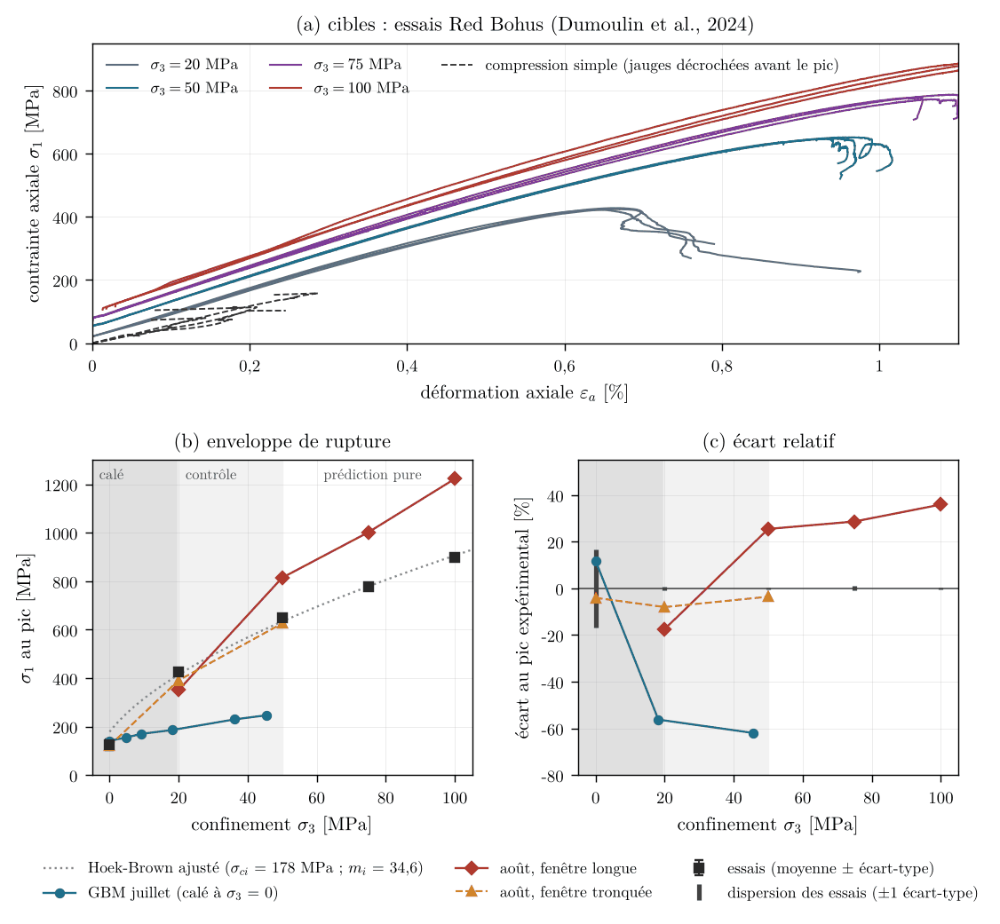

# calibration_redbohus : calibration bayésienne du Red Bohus (août 2026)

## 1. Objet

Deuxième campagne de calibration des paramètres de joints FDEM 2D sur le granite de Red Bohus (essais de Dumoulin et al. 2024). Six paramètres libres (ft, c, φ, G_I, G_II/G_I, plafond déviatorique) ; émulateur gaussien sur 60 calculs, loi a posteriori par Metropolis-Hastings.

Question : un jeu de paramètres, avec son incertitude, reproduit-il la compression simple, le brésilien et le triaxial à 20 MPa, et prédit-il les triaxiaux à 50, 75 et 100 MPa qu'il n'a pas vus ?

## 2. Statut

| date | état |
|---|---|
| 15 août 2026 | protocole (`METHODOLOGIE.md`, sections ci-dessous) |
| 15-19 août 2026 | phase A (choix d'architecture), criblage, base LHS, enrichissement, inversion, calculs de contrôle |
| 31 août 2026 | jeu de juillet invalidé ; émulateur d'août infirmé par les calculs réels |
| 6-7 octobre 2026 | rien de ce dossier n'a été rejoué |

Étude terminée, résultat négatif ; aucune calibration n'est valide aujourd'hui. Ce qui reste valable : les cibles expérimentales (`targets/`), le protocole et l'échec de la prédiction, qui tient à l'enveloppe de Mohr-Coulomb linéaire des joints. Le jeu de juillet (modèle à grains, hors de ce dossier) n'est plus reproductible : rejoué le 6 octobre avec le binaire courant, il donne 33,03 MPa en compression simple contre 139,1 MPa ; les correctifs de l'amortisseur de joint du 5 août en sont les candidats. Les calculs d'août sont postérieurs à ces correctifs mais n'ont pas été rejoués. La correction du contact du 7 octobre (`docs/rapport_guide/ENQUETE_CONTACT.md`) est optionnelle et n'a pas été appliquée.

## 3. Résultat principal

- Loi a posteriori (`calibration_result.json`) : ft 25,7 MPa (20,2 à 43,9), c 11,0 MPa (10,0 à 14,2, borne basse), φ 46,2° (40,1 à 49,8), G_I 50,1 J/m² (30,7 à 115,7, borne basse), G_II/G_I 2,63, plafond déviatorique 462 MPa (212 à 1 242).
- Jeu retenu (`points_results.csv`, ligne `CALT`) : σ₁ = 350,9 MPa à 20 MPa (−17 %), 814,4 MPa à 50 MPa (+25 %), 1 002 et 1 222 MPa à 75 et 100 MPa (+29 et +36 %). La prédiction échoue au-delà du critère de 20 % ; l'enveloppe simulée est trop raide.
- Un jeu voisin calculé sur une fenêtre tronquée semblait s'accorder à 50 MPa (−3,6 %) : artefact de la troncature.
- L'émulateur est infirmé (R² croisé 0,44 sur la compression simple, écart-type 56 MPa contre 21,4 MPa pour l'essai) ; 60 points en dimension 6 ne suffisent pas.

## 4. Figures



(a) Essais de Dumoulin et al. ; (b) enveloppe de rupture : le jeu de juillet sous-estime le confinement, celui d'août le surestime au-delà d'environ 35 MPa ; (c) écart au pic expérimental. Aperçu de `docs/rapport_guide/figures/calib/fig_calib_synthese.png`.

## 5. Contenu du dossier

| chemin | contenu |
|---|---|
| `METHODOLOGIE.md` | protocole détaillé : critères de succès, leçons de la littérature (Ye 2025, Bu 2026, Jiang 2025), phases A à D |
| `targets/` | cibles extraites des essais (`targets_redbohus.json`, `curves_redbohus.json`) |
| `configs/phaseA_*.cfg` | phase A, choix d'architecture (A1, A2, A3) |
| `configs/c_<param>_lo/hi_*.cfg`, `c_C_*.cfg` | criblage à une variable autour du point central C |
| `configs/c_L*.cfg`, `c_E*.cfg` | base hypercube latin (L) et enrichissement adaptatif (E) |
| `configs/c_CAL*.cfg`, `c_CALT*.cfg`, `c_PAR_*.cfg` | jeux calibrés, jeu retenu à fenêtre longue, témoins élastique et DP-DFH |
| `configs/demo_cutting_*.cfg`, `demo_rupture_nette.cfg` | démonstrations de coupe PDC et de rupture, hors calibration |
| `screen_results.csv`, `points_results.csv`, `*_points.json`, `screen_keep.json` | résultats du criblage et des points calculés |
| `calibration_result.json` | meilleur point et intervalles a posteriori |
| `tools/campaign.py`, `run_phaseA.py`, `enrich.py`, `analyze.py` | moteur de campagne, phase A, enrichissement, analyse (criblage, émulateur, inversion, Pareto, loi a posteriori) |
| `tools/extract_targets.py`, `extract_curves.py` | extraction des cibles depuis le jeu Zenodo |
| `tools/plot_*.py` | figures de la campagne et de la coupe |
| `tools/*.cmd`, `*_console.log` | scripts de lancement Windows et journaux |

Les sorties de calcul (`runs/`) et les figures ne sont pas versionnées (`.gitignore`).

## 6. Rejouer

```sh
build/rockim calibration_redbohus/configs/c_CALT_tx50_s4211.cfg out_CALT_tx50
python3 calibration_redbohus/tools/analyze.py screen
```

`tools/campaign.py` et les scripts `tools/run_*.cmd` enchaînent les calculs d'une phase (lancement historique sous Windows). Chapitre du rapport-guide : `docs/rapport_guide/sections/r07a_calib.tex`, sous-section « Août : émulateur gaussien et prédiction triaxiale », dans [rapport_guide_rockim.pdf](../docs/rapport_guide/rapport_guide_rockim.pdf).

## Annexe : protocole d'origine (15 août 2026)


Calibration des paramètres de joints FDEM de rockim sur le granite Red
Bohus, selon la méthodologie de l'état de l'art 2025-2026 (§4). Objectif :
un jeu de paramètres avec son incertitude, capable de reproduire UCS,
brésilien et enveloppe triaxiale — et de prédire les confinements non vus.

### 1. Données expérimentales (cibles)

Source : Dumoulin et al. (2024), *Geomechanics for Energy and the
Environment* 40, 100592 ; dataset Zenodo `10.5281/zenodo.10617548`.
Granite du sud-ouest de la Suède, 60 % feldspath / 35 % quartz / 5 % biotite
(poids), taille de grain 1-3 mm.

Extraction : `tools/extract_targets.py` → `targets/targets_redbohus.json`
(scalaires + courbes σ-ε moyennes rééchantillonnées + écarts-types).

| Cible | Valeur | Écart-type | Rôle |
|---|---|---|---|
| UCS (4 essais) | 126,6 MPa | ±21,4 (17 %) | calibration |
| BTS (4 essais, recalculé des .ASC) | 10,27 MPa | ±0,98 | calibration |
| q(σ₃ = 20) (3 essais) | 404,8 MPa | ±2,8 | calibration |
| q(σ₃ = 50) (3 essais) | 599,0 MPa | ±2,6 | calibration |
| q(σ₃ = 75) / q(σ₃ = 100) | 704,0 / 799,3 MPa | ±7,6 / ±4,2 | prédiction pure |
| E / ν | 77,7 GPa / 0,29 | — | sortie à reproduire |

Pièges documentés. (a) Trois élasticités circulent dans l'archive pour
ce granite (52/0,25 littérature DP-DFH ; 57,3/0,17 « local moyen » PSO ;
77,66/0,29 fit des 12 branches triaxiales) — on retient la dernière et E, ν
deviennent des sorties du modèle, pas des entrées figées (méthode Bu 2026).
(b) La cible de traction est le BTS mesuré (10,3 MPa), pas le σt = 18,3 MPa
Weibull de Saadati/Shariati qui avait servi au GBM de juillet. (c) L'enveloppe
est concave (pente locale 13,9 → 3,8) : Mohr-Coulomb linéaire ne peut pas
la suivre partout, d'où le partage calibration / prédiction. (d) La dispersion
expérimentale de l'UCS est de 17 % — viser mieux n'a pas de sens physique ;
les triaxiaux (±0,5 %) sont les cibles exigeantes.

### 2. Méthode (état de l'art)

- Ye et al. 2025 (IJRMMS 194, 106233) : objectifs sur la courbe entière
  σ-ε (pas le seul pic) + le mode de rupture comme objectif formel,
  optimisation multi-objectif NSGA-II (front de Pareto, pas de poids
  arbitraires) ; bulk élasto-plastique Mohr-Coulomb.
- Bu et al. 2026 (IJRMMS 199, 106400, open access) : base de 3456
  simulations UDEC-BBM (UCS + confinés 10/20/30 + brésilien), comparaison
  RF / SVR / GPR / DNN, inversion par grid search, validation par 1485
  runs ; cibles = E, ν, UCS, BTS, c, φ.
- Jiang et al. 2025 (Sci. Rep. 15:34923) : 328 runs suffisent,
  analyse de corrélation pour réduire la dimension, stacking d'ensembles,
  erreurs finales 0,6 % (UCS) à 10,6 % (BTS) ; taille de bloc = L/20 ;
  le BTS est la sortie la plus dispersée (COV > 8 %) → plusieurs graines.

Tous calibrent des modèles à blocs Voronoï (BBM/GBM), pas des maillages
homogènes : c'est la structure qui produit l'enveloppe non linéaire et le bon
ratio UCS/BTS.

Notre apport par rapport à ces trois papiers : un postérieur bayésien
sur l'émulateur (incertitude + identifiabilité + corrélations entre
paramètres), et un test de prédiction sur des confinements non vus.

### 3. Phases

| Phase | Contenu | Budget |
|---|---|---|
| 0 | cibles (fait) ; géométries réelles ; grain L/20 ; indépendance au taux ; 3 graines pour le BTS | ~1 h |
| 1 | criblage mono-variable + corrélations → quels paramètres pilotent quoi | ~50 runs |
| 2 | base de données : hypercube latin sur les paramètres retenus × 4 essais | ~250 jeux, ~2 h parallélisé |
| 3 | émulateur (GPR vs RF, protocole Bu) puis postérieur bayésien + front de Pareto en contrôle | minutes |
| 4 | validation : 3 graines au jeu calibré + prédiction σ₃ = 75 et 100 | ~12 runs |

### 4. Paramètres candidats

`ft_joint`, `cohesion_joint`, `frictionDeg_joint`, `Gf` (mode I),
`gfShearFactor` (mode II), `jointPenaltyFactor`, `crushCap` (cap déviatorique
du bulk — proxy de la plasticité MC de Ye), `E_bloc`.

### 5. Discipline

Schémas figés pour toute la campagne (capacités validées du solveur) :
`insertion = adaptive`, `jointSoftening = yan`, `jointShearUnload = origin`,
`contact = potential`, `gcActivation = adaptive`, `stopPeakDrop`,
`budgetAbortPct`/`budgetAbortMin`. Toute configuration de run est soumise à
validation de Fernando AVANT lancement.
