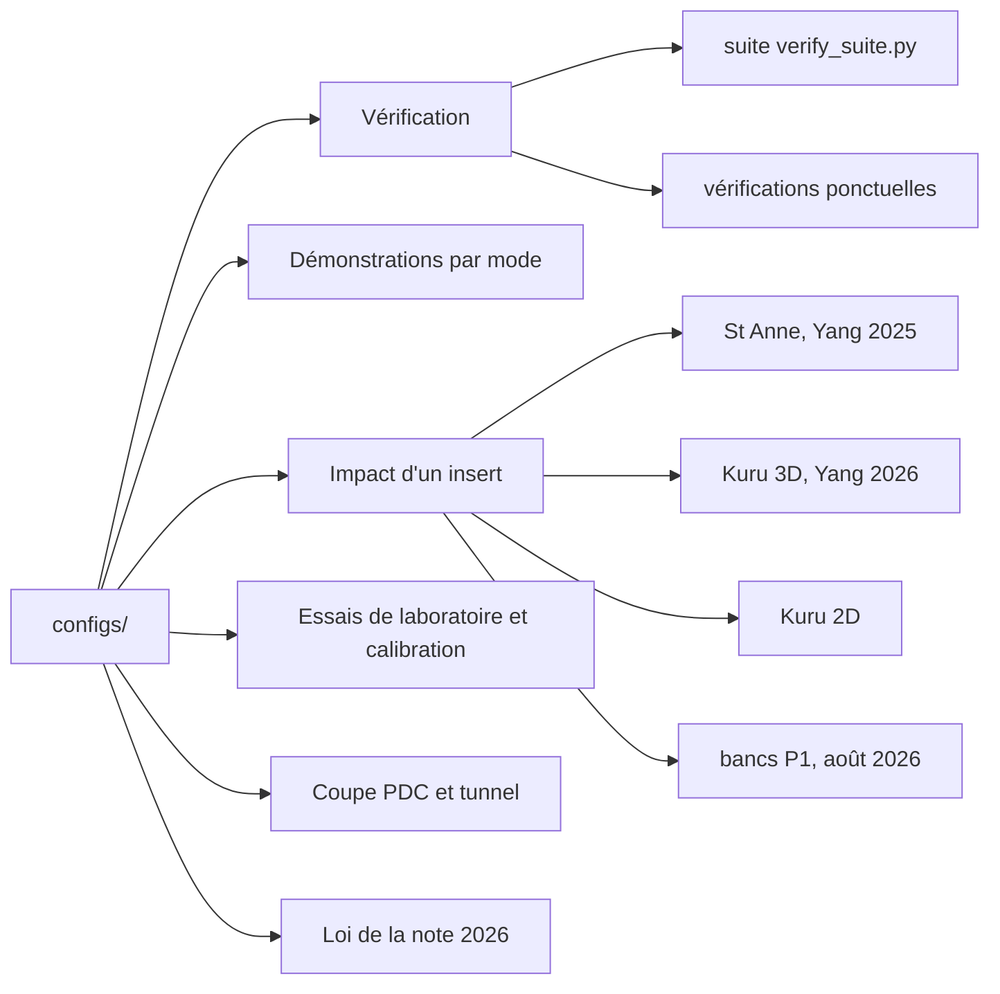

# configs/ — les fichiers de configuration de rockim

Un fichier `.cfg` décrit un calcul complet : mode de résolution, géométrie ou maillage, matériaux,
chargement, sorties. La syntaxe et toutes les clés sont décrites dans
[DOCUMENTATION_rockim.md](../DOCUMENTATION_rockim.md) §4-5. On lance un calcul par
`rockim configs/<fichier>.cfg <dossier_de_sortie>`.

Le dossier contient 271 configurations (249 à la racine, 22 dans `mini/`) et un générateur
(`mini/gen_mini.py`). La plupart portent en tête un commentaire qui donne l'objet, la date, la
commande de maillage et la source bibliographique. Les fichiers dont le nom commence par `_` sont
des sondes ou des variantes ponctuelles d'un deck principal.

## Trois dossiers de configurations

| Dossier | Contenu | Usage |
|---|---|---|
| `configs/` | les 271 decks du projet, toutes études confondues | dossier principal, lu par `tools/verify_suite.py` |
| [`configs_bench/`](../configs_bench/README.md) | 5 decks et 5 journaux d'un seul banc de pénalité (11/09/2026) | archive d'une mesure ponctuelle |
| [`configs_yan/`](../configs_yan/README.md) | 95 decks et 4 générateurs pour reproduire Yan, Zheng et Wang (2023) et calibrer Red Bohus en 2D | campagne Yan et calibration ; deux decks dans la suite de tests |

## Structure

## Inventaire par famille

Modes : `fem`, `dem`, `fdem` (2D) ; `fem3d`, `dem3d`, `fdem3d` (3D). Statuts : référence (deck qui
produit un résultat cité), suite de tests (lu par `tools/verify_suite.py`), étude (deck d'une étude
datée, encore utile), archive (étape dépassée, gardée pour la traçabilité).

| Famille | Fichiers clés | Nombre | Mode | Objet | Statut |
|---|---|---:|---|---|---|
| Vérification, suite de tests | `verify_fdem_tension`, `verify_fdem3d_tension`, `verify_fdem_voronoi_tension`, `verify_fdem3d_voronoi_tension`, `verify_dem_tension`, `verify_dem3d_tension`, `verify_fem_bar`, `verify_fdem3d_loads`, `verify_fem3d_loads`, `verify_fdem_toolcontact`, `fdem_percussion`, `fdem3d_percussion`, `fdem3d_percussion_base`, `fdem3d_bench1_insert`, `fdem3d_loads_rupture` | 15 | tous | cas courts à réponse connue : traction directe, célérité d'onde, charges par groupes, contact outil, percussion témoin | suite de tests |
| Vérification ponctuelle | `verify_fem3d_dp`, `verify_fem3d_rate1/2`, `verify_fem3d_tension`, `verify_fdem_brazilian`, `verify_fdem_toolcut_break`, `xval_fem3d_saksala2011`, `tension3d_adaptive_*`, `verif2d_*`, `s4_budget_tension3d`, `_ucs2d_camacho_check` | 15 | fem3d, fdem, fdem3d | contrôles hors suite : loi DP et effet de vitesse, validation croisée Abaqus, critère d'insertion adaptative sur champ uniforme, budget d'énergie | étude |
| Démonstrations par mode | `fem_percussion`, `dem_percussion`, `fem3d_percussion_*`, `fdem_voronoi_*`, `fdem3d_percussion_etoile*`, `fem_shear`, `dem_shear`, `fdem3d_shear` | 31 | tous | même outil (disque ou sphère) en percussion ou en coupe, pour comparer FEM, DEM et FDEM, lois de volume (Saksala, DP-DFH) et structures de grains | archive |
| Impact St Anne (Yang et al. 2025) | `stanne2025_rock137_visc0`, `stanne2025_rock137_visc0_T500`, `stanne2025_bench_s25_visc0`, `stanne2025_bench_s25_visc`, `impact_uni`, `indent2d_fin`, `yang_equiv*` | 8 | fdem3d, fdem | calcaire de St Anne frappé à 10,66 m/s par le train complet | référence (`stanne2025_rock137_visc0`, run du 14/09) ; `_T500` prêt, non lancé ; les autres en étude |
| Impact Kuru 3D (Yang et al. 2026) | `yang2026_impact` (deck v2), `yang2026_impact_v3_plastic`, `yang2026_bench_s25_*` (34 bancs courts s = 2,5), `yang2026_bis3d_*` (bissection), `yang2026_kuru_train1_v5`, `impact3d_kuru_*`, `impact3d_yang*` | 64 | fdem3d | granite de Kuru, insert unique, loi de joint de Solidity ; bancs de bissection et de correction des 11-14/09 | `yang2026_impact` et `yang2026_bench_s25_v3P_300` en référence ; le reste en étude ou archive |
| Impact Kuru 2D | `impact_kuru`, `impact2d_kuru_*`, `impact2d_bis_V0` à `V20`, `_m50` à `_m400`, `_imp_*`, `impact2d_bouton` | 45 | fdem | reproduction 2D du cas Kuru, bissection des réglages (12/09) | archive |
| Bancs d'impact P1 (août 2026) | `p1_banc`, `p1_banc_mid`, `p1_banc_v2`, `elast_*`, `smoke_*`, `impact3d_adap_*`, `impact3d_sz_*`, `impact3d_decisif`, `impact3d_ultra`, `indent2d_yan`, `indent3d_*` | 27 | fdem3d, fdem | convergence du contact, panoplie adaptative, homogène contre Weibull, indentation | archive |
| Essais de laboratoire et calibration | `bohus_gbm_calibrated`, `bohus_ucs_calibrated`, `brazilian_bohus_gbm`, `triax_bohus_gbm`, `cal_ucs_bohus`, `cal_bts_bohus`, `bd_yan_adaptatif`, `ucs_yan_adaptatif`, `yan_strip_adaptatif`, `heilman_bd`, `heilman_ucs`, `triax3d_*`, `tx_adap3d_*`, `tx_adap_base3d`, `_mesh_rand`, `_mesh_struct` | 23 | fdem, fdem3d | brésilien, compression simple et triaxiale sur le GBM Red Bohus calibré (calibration bayésienne du 31/07), sur les cas de Yan 2023 et de Heilman 2024 ; objectivité de maillage en triaxial 3D | référence pour les jeux `bohus_*` calibrés ; étude pour le reste |
| Coupe PDC | `cut3d_heilman`, `cut2d_heilman_v3`, `cut2d_v3bis_jeu`, `cut2d_v3ter_rake`, `heilman_pdc_cut`, `_cut3d_*` | 8 | fdem, fdem3d | coupe au cutter PDC d'après Heilman et al., ARMA 24-0238 (code HOSS) | `cut3d_heilman` cité par le rapport-guide ; étude |
| Tunnel | `tunnel_bore`, `tunnel_bore_corr`, `tunnel_bore_fast`, `tunnel_bore_weib` | 4 | fdem | plaque 100 × 100 mm percée d'une cavité pressurisée, analogue du banc 6 Abaqus DP-DFH | étude |
| Loi de la note 2026 | `loi_note_2026`, `_loi_note_2026_*`, `mini/mini_n4_*` | 9 + 22 | fdem3d | loi « FDEM hybride à insertion adaptative » en une carte, ses variantes d'isolation et le petit assemblage 3 × 3 × 3 généré par `mini/gen_mini.py` | étude (spécification : [`docs/SPEC_loi_note_2026.md`](../docs/SPEC_loi_note_2026.md)) |

## Où trouver le détail

| Question | Document |
|---|---|
| ce que vérifie chaque cas de la suite | `tools/verify_suite.py`, et [`docs/VV_campagne.md`](../docs/VV_campagne.md) |
| le run St Anne et sa reproduction | [`docs/REPRODUIRE_stanne_radiales_2026-09-14.md`](../docs/REPRODUIRE_stanne_radiales_2026-09-14.md), [`results/data/stanne2025_rock137/`](../results/data/stanne2025_rock137/LISEZMOI.md) |
| les bancs Kuru des 11-14/09 | [`docs/notes/ETAT_yang2026_2026-09-11.md`](../docs/notes/ETAT_yang2026_2026-09-11.md), [`docs/notes/DECKS_conformite_2026-09-13.md`](../docs/notes/DECKS_conformite_2026-09-13.md) |
| les maillages appelés par les decks | [`meshes/README.md`](../meshes/README.md) |
| l'index de toute la documentation | [`docs/README.md`](../docs/README.md) |
