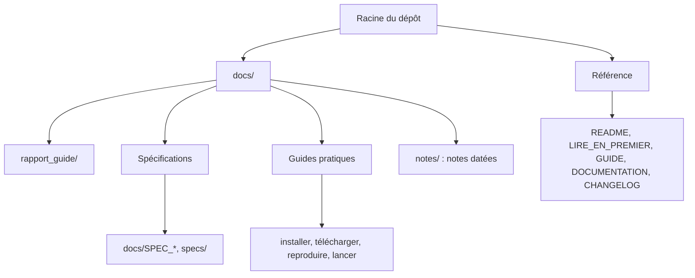

# docs/ — index de la documentation de rockim

Toute la documentation du dépôt, classée en quatre groupes : référence, rapport-guide,
spécifications, notes datées. Les documents de référence et le rapport-guide décrivent l'état
actuel ; les notes datées décrivent un état passé et ne sont pas mises à jour.

## Référence

| Document | Contenu |
|---|---|
| [`README.md`](../README.md) | présentation du code, carte du dépôt |
| [`LIRE_EN_PREMIER.md`](../LIRE_EN_PREMIER.md) | parcours de lecture pour un encadrant, état au 7 octobre 2026 |
| [`GUIDE_rockim.md`](../GUIDE_rockim.md) | prise en main |
| [`DOCUMENTATION_rockim.md`](../DOCUMENTATION_rockim.md) | commandes, toutes les clés de configuration, sorties, pièges connus |
| [`CHANGELOG.md`](../CHANGELOG.md) | historique des modifications depuis le tag `g0-0.1.0` |
| [`LISEZ_MOI.md`](../LISEZ_MOI.md) | dossier de partage du 30 août 2026, gardé pour mémoire |
| [`docs/VV_campagne.md`](VV_campagne.md) | campagne de vérification et de validation, document vivant commencé le 3 octobre 2026 ; bancs dans [`vv/`](../vv/README.md) |

## Rapport-guide

Le rapport-guide est le document de synthèse : formulation, vérification, sensibilités, validation,
impact, coût, et les annexes de reproduction. Source LaTeX et PDF compilé dans
[`docs/rapport_guide/`](rapport_guide/) : [`rapport_guide_rockim.pdf`](rapport_guide/rapport_guide_rockim.pdf).

## Spécifications

| Document | Statut |
|---|---|
| [`docs/SPEC_loi_note_2026.md`](SPEC_loi_note_2026.md) | contrat d'implémentation de la loi « FDEM hybride à insertion adaptative » dans `rockim_g1` ; decks `configs/loi_note_2026*.cfg` |
| [`specs/`](../specs/README.md) | cinq spécifications Spec Kit d'août 2026 (performance, registre de lois de joint, cutter PDC 3D, couplage hydro-mécanique, impact Yang), avec leur état constaté |

## Guides pratiques

Gardés à la racine de `docs/` parce qu'ils servent encore, bien que leur nom porte une date.

| Document | Contenu |
|---|---|
| [`docs/TELECHARGER_nouveau_poste_2026-09-13.md`](TELECHARGER_nouveau_poste_2026-09-13.md) | tout récupérer sur un poste neuf : les deux dépôts, leur taille, leur accès |
| [`docs/INSTALLER_macOS_2026-09-14.md`](INSTALLER_macOS_2026-09-14.md) | compiler et lancer rockim sur un Mac |
| [`docs/REPRODUIRE_stanne_radiales_2026-09-14.md`](REPRODUIRE_stanne_radiales_2026-09-14.md) | relancer depuis un clone le run St Anne qui donne les fissures radiales |
| [`docs/LANCER_stanne_T500_macOS_2026-09-15.md`](LANCER_stanne_T500_macOS_2026-09-15.md) | lancer le St Anne complet (500 µs) sur un Mac ; deck prêt, non lancé |

## Notes datées

35 comptes rendus ponctuels et un fichier de mesures, d'août au 3 octobre 2026 : audits,
plans, rapports de nuit, passations, analyses de runs. Index chronologique, une ligne par note :
[`docs/notes/README.md`](notes/README.md). Les plus utiles pour comprendre l'état actuel :

| Note | Pourquoi |
|---|---|
| [`notes/COMPARAISON_yang2025_stanne_2026-09-14.md`](notes/COMPARAISON_yang2025_stanne_2026-09-14.md) | la comparaison chiffrée du run St Anne à Yang et al. 2025 |
| [`notes/ECARTS_guo2014_rockim_2026-09-13.md`](notes/ECARTS_guo2014_rockim_2026-09-13.md) | écarts au modèle de Guo 2014 / Solidity et mesures du run St Anne |
| [`notes/HANDOFF_2026-10-03.md`](notes/HANDOFF_2026-10-03.md) | dernière passation avant la campagne V&V |

## Documentation des dossiers de données

| Dossier | README |
|---|---|
| configurations | [`configs/`](../configs/README.md), [`configs_yan/`](../configs_yan/README.md), [`configs_bench/`](../configs_bench/README.md) |
| maillages | [`meshes/`](../meshes/README.md) |
| exemples | [`exemples/`](../exemples/README.md) |
| résultats et figures | [`results/`](../results/README.md), [`output/`](../output/README.md) |
| historique des binaires d'août | [`versions/`](../versions/README.md) |
