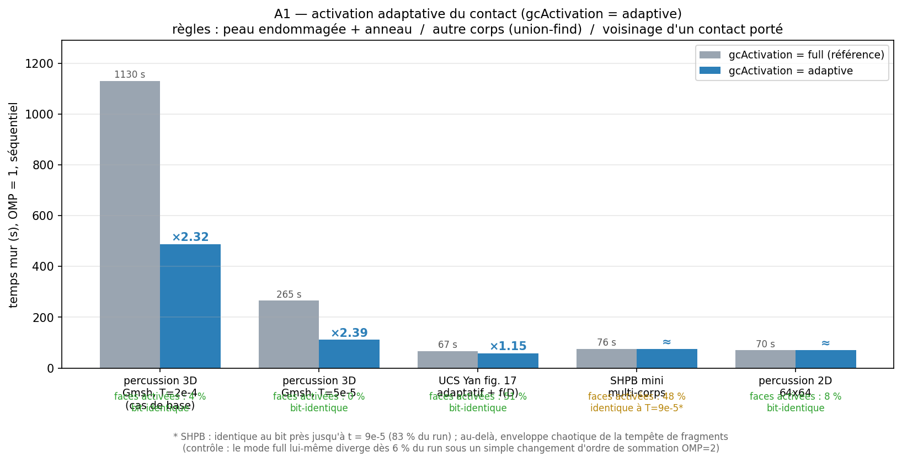

# docs/notes/ — notes datées

Comptes rendus ponctuels : états des lieux, audits, plans, rapports de nuit, passations, analyses
d'un run. Chaque note décrit l'état du code et des connaissances à sa date ; une note plus récente
peut la corriger. Pour l'état actuel, lire d'abord [`LIRE_EN_PREMIER.md`](../../LIRE_EN_PREMIER.md)
et le [rapport-guide](../rapport_guide/rapport_guide_rockim.pdf). L'index de toute la documentation
est dans [`docs/README.md`](../README.md).

Les arbres cités (`rockim_f2`, `rockim_g0`, `rockim_g1`) sont les étapes successives du même code :
`f2` jusqu'au 5 septembre 2026, `g0` à partir du tag `g0-0.1.0`, `g1` à partir du 11 septembre.

## Index chronologique

| Date | Note | Objet |
|---|---|---|
| avant le 19/08/2026 | [README_historique_FEM_DEM_2D.md](README_historique_FEM_DEM_2D.md) | ancien README, en anglais, du code 2D FEM/DEM d'origine (percussion et coupe) |
| 11/08/2026 | [PLAN_article_exact.md](PLAN_article_exact.md) | branche « article exact » : supprimer les différences structurelles avec Yan et al. 2023 |
| 13/08/2026 | [ROADMAP_rockim.md](ROADMAP_rockim.md) | feuille de route : parité avec MultiFracS, impact validable, robustesse et vitesse |
| 14/08/2026 | [REVUE_fiabilite3d_2026-08-14.md](REVUE_fiabilite3d_2026-08-14.md) | instabilité du 3D en phase débris : diagnostic, revue de littérature, plan |
| 19/08/2026 | [CHANGES_YAN.md](CHANGES_YAN.md) | ajouts au code pour reproduire Yan, Zheng et Wang 2023, chacun derrière une clé |
| 19/08/2026 | [PLAN_correctifs_2026-08-19.md](PLAN_correctifs_2026-08-19.md) | manques physiques et numériques de rockim, correctifs proposés |
| 25/08/2026 | [BILAN_insertion_adaptative.md](BILAN_insertion_adaptative.md) | bilan de l'étude de l'insertion adaptative face aux macro-fissures (22-25/08) |
| 31/08/2026 | [RELEASE_NOTES_2026-08-31.md](RELEASE_NOTES_2026-08-31.md) | état du dépôt au 31/08 pour la mise à jour GitHub |
| 01/09/2026 | [THERMO_revue_et_plan.md](THERMO_revue_et_plan.md) | choc thermique pour préfissurer avant percussion : revue (69 références) et plan |
| 01/09/2026 | [CHANTIER_f2.md](CHANTIER_f2.md) | cinq capacités 2D pour AbuAisha et al. 2017 et un plantage corrigé |
| 02/09/2026 | [HANDOFF_2026-09-02.md](HANDOFF_2026-09-02.md) | passation du chantier `rockim_f2` |
| 05/09/2026 | [ETAT_DES_LIEUX_2026-09-05.md](ETAT_DES_LIEUX_2026-09-05.md) | état des lieux factuel de `rockim_f2` (89 constats, trois relectures) |
| 05/09/2026 | [PLAN_ROBUSTESSE_2026-09-05.md](PLAN_ROBUSTESSE_2026-09-05.md) | plan de robustesse tiré de l'état des lieux |
| 05/09/2026 | [PORT_INSERTION_POINTE.md](PORT_INSERTION_POINTE.md) | port de la branche `insertion-pointe` dans `g0` |
| 05/09/2026 | [PORT_JOINT_HANDOFF.md](PORT_JOINT_HANDOFF.md) | branche `joint-handoff` : verdict ligne par ligne, rien n'est porté |
| 06/09/2026 | [DFHPLUS_etape1.md](DFHPLUS_etape1.md) | loi `dfhplus`, étape 1 : le périmètre de DP-DFH sur un cadre thermodynamique neuf |
| 11/09/2026 | [AUDIT_loi_adaptative_2026-09-11.md](AUDIT_loi_adaptative_2026-09-11.md) | `rockim_g0` face à la note « lois constitutives pour un FDEM hybride à insertion adaptative » |
| 11/09/2026 | [BANC_yang2026_impact.md](BANC_yang2026_impact.md) | montage du banc d'impact de Yang et al. 2026 (Kuru) |
| 11/09/2026 | [ETAT_yang2026_2026-09-11.md](ETAT_yang2026_2026-09-11.md) | rockim face aux impacts d'Imperial (Solidity) : ce qui marche, ce qui reste ; journal des bancs jusqu'au 13/09 |
| 11/09/2026 | [RETOUR_v3_2026-09-11.md](RETOUR_v3_2026-09-11.md) | ce que les runs ont produit sur la note v3, et ce qu'ils concluent |
| 11/09/2026 | [ADAPTATIF_impact_2026-09-11.md](ADAPTATIF_impact_2026-09-11.md) | l'insertion adaptative est-elle utilisable pour un impact ? |
| 12/09/2026 | [PLAN_loi_joint_2026-09-12.md](PLAN_loi_joint_2026-09-12.md) | la loi de joint, d'abord mathématique puis numérique, d'après Solidity |
| 12/09/2026 | [DIAGNOSTIC_ICL_independant_2026-09-12.md](DIAGNOSTIC_ICL_independant_2026-09-12.md) | diagnostic indépendant de la reproduction d'ICL dans rockim |
| 12/09/2026 | [mesures_ICL_2026-09-12.json](mesures_ICL_2026-09-12.json) | mesures brutes du diagnostic (maillage, volumes de phases, historique) |
| 12/09/2026 | [COMPLEMENT_YANG_sources_et_corrections_2026-09-12.md](COMPLEMENT_YANG_sources_et_corrections_2026-09-12.md) | les quatre articles Yang/ICL : informations supplémentaires et corrections à privilégier |
| 13/09/2026 | [AUDIT_2026-09-13.md](AUDIT_2026-09-13.md) | audit de la nuit du 12 au 13/09 : loi de joint, contact, performance, deck v3 |
| 13/09/2026 | [RAPPORT_nuit_2026-09-13.md](RAPPORT_nuit_2026-09-13.md) | rapport de la nuit du 12 au 13/09 sur l'impact Yang 2026 |
| 13/09/2026 | [POINT_rockim_2026-09-13.md](POINT_rockim_2026-09-13.md) | le point sur rockim : ce qu'il sait faire, ce qui manque |
| 13/09/2026 | [ECARTS_guo2014_rockim_2026-09-13.md](ECARTS_guo2014_rockim_2026-09-13.md) | écarts entre rockim et le modèle de Guo 2014 / Solidity : liste, jugement, décision ; mesures chiffrées |
| 13/09/2026 | [CAMPAGNE_correction_2026-09-13.md](CAMPAGNE_correction_2026-09-13.md) | cadrage de la campagne de correction de l'après-midi |
| 13/09/2026 | [DECKS_conformite_2026-09-13.md](DECKS_conformite_2026-09-13.md) | decks de conformité de la campagne (tâche T4) |
| 13/09/2026 | [MAILLAGE_serie_2026-09-13.md](MAILLAGE_serie_2026-09-13.md) | série de maillages à train figé et masses du train (tâche T3) |
| 13/09/2026 | [FIGURES_ICL_STANNE_165us_2026-09-13.md](FIGURES_ICL_STANNE_165us_2026-09-13.md) | St Anne à 165 µs : fissures radiales et rendu comparable aux figures d'ICL |
| 13/09/2026 | [COMPARAISON_SURFACE_STANNE_165us.md](COMPARAISON_SURFACE_STANNE_165us.md) | St Anne à 165 µs : traces sur la surface initiale et coupe à -0,5 mm |
| 13/09/2026 | [FIGURES_pour_le_rapport_2026-09-13.md](FIGURES_pour_le_rapport_2026-09-13.md) | où sont les figures et ce que chacune montre (mis à jour le 14/09) |
| 14/09/2026 | [COMPARAISON_yang2025_stanne_2026-09-14.md](COMPARAISON_yang2025_stanne_2026-09-14.md) | rockim contre Yang et al. 2025, critère par critère, sur le run St Anne terminé |
| 03/10/2026 | [HANDOFF_2026-10-03.md](HANDOFF_2026-10-03.md) | passation : charges par groupes, accélération, bancs en cours |

## Sous-dossiers

| Dossier | Contenu |
|---|---|
| `figures/` | trois figures de travail, sans note qui les cite : gain de l'activation adaptative du contact (`A1_gcactivation.png`), UCS et équation 18 (`A2_ucs_eq18.png`), banc moyen partiel (`banc_mid_partiel.gif`) |
| `journaux/` | sorties brutes de la suite de vérification de l'arbre `f2` (`suite_f2*.txt`) et deux journaux de test (`log_t5a.txt`, `log_t5b.txt`) |

