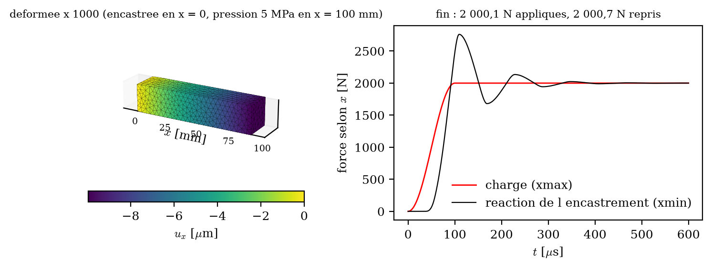

# Exemple : barre encastrée à gauche, appui à droite

Barre de granite 100 × 20 × 20 mm, encastrée sur sa face gauche (`xmin`), avec une pression de 5 MPa
qui appuie sur sa face droite (`xmax`). C'est le plus petit montage complet écrit avec les charges et
conditions aux limites par groupes (`DOCUMENTATION_rockim.md` §5.21).



## Contenu du dossier

| fichier | rôle |
|---|---|
| `barre.msh` | maillage Gmsh MSH 2.2, 3 673 tétraèdres, avec les groupes nommés : volume `solid`, faces `xmin xmax ymin ymax bottom top`, coins `c000` … `c111` |
| `barre.cfg` | le deck commenté, avec des variantes à décommenter (force totale, charge morte, vitesse imposée, force ponctuelle) |
| `fig_barre.py` | la figure ci-dessus à partir du dossier de sortie |
| `barre_resultat.png/.pdf` | la figure du run de référence |

## Lancer

Depuis la racine du dépôt :

```sh
./build/rockim exemples/barre_encastree/barre.cfg exemples/barre_encastree/out
python3 exemples/barre_encastree/fig_barre.py exemples/barre_encastree/out
```

Régénérer le maillage (Gmsh en Python, `pip install gmsh`) :

```sh
python3 tools/make_unstructured_mesh.py box3dbc 0.10 0.02 0.02 0.004 exemples/barre_encastree/barre.msh 1
```

## Les quatre lignes qui font le montage

```
scenario = loads              # ni outil ni appui automatique
fix.xmin = all                # encastrement
pressure.xmax = 5e6           # appui de 5 MPa (pression suiveuse, > 0 pousse)
amplitude.xmax = ramp 1e-4    # montée douce en 0,1 ms
```

## Résultat de référence

Raccourcissement de la face droite **−9,950 µm**, pour p·L/E = 10,0 µm en barre libre latéralement :
l'encastrement complet empêche le gonflement de Poisson près de `xmin`, d'où 0,5 % de raideur en plus.
La réaction de l'encastrement vaut **2 000,7 N** pour 2 000,1 N appliqués, et le bilan d'énergie
ferme à 9e-13 %. La courbe de droite montre le transitoire : l'onde fait l'aller-retour dans la barre,
puis l'amortissement (`dampingLocal = 0,7`) ramène l'état quasi statique en 0,4 ms environ.

Les sorties à lire : dans `history.csv`, les colonnes `U_xmax_x` (déplacement moyen de la face),
`RF_xmin_x` (réaction de l'encastrement) et `F_xmax_x` (charge appliquée) ; à la fin du résumé, une
ligne `groupe <nom> : U = … ; RF = … ; F = …` par groupe.
