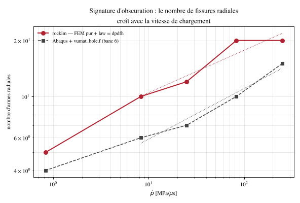

# exo_tunnel : cavité pressurisée 2D en éléments finis purs (banc 6 de la thèse refait dans rockim)

## 1. Objet

Le banc 6 de la thèse (« exo hole » : plaque de 200 × 200 mm percée d'un trou de 10 mm de rayon, pression interne en rampe jusqu'à 250 MPa, loi DP-DFH sous Abaqus avec la VUMAT `vumat_hole.f`) est refait dans rockim en éléments finis continus, sans aucun élément cohésif : `mode = fdem`, `law = dpdfh`, résistances de joint inatteignables (`ft = cohesion = 1e12`), si bien qu'aucune arête ne s'insère et que toute la fissuration passe par la loi de volume.

Question : le portage de DP-DFH dans rockim retrouve-t-il la signature d'obscuration du banc Abaqus, c'est-à-dire un nombre de fissures radiales qui croît avec la vitesse de chargement ?

## 2. Statut

Étude terminée le 24 août 2026 (date des fichiers), comparaison de code à code. Aucun joint ne s'insère : la correction du contact du 7 octobre 2026, qui porte sur les paires de triangles du contact général après fissuration, ne devrait pas s'appliquer ; cela n'a pas été vérifié par un rejeu. La calibration de juillet n'intervient pas (carte DP-DFH quasi statique du Bohus). Les sorties de calcul ne sont pas versionnées ; seuls les chiffres reportés dans `tools/fig_exo_sweep.py` en restent.

## 3. Résultat principal

- Nombre d'armes radiales, rockim contre Abaqus (banc 6), pour ṗ = 0,83 / 8,3 / 25 / 83 / 250 MPa/µs : 5 / 10 / 12 / 20 / 20 contre 4 / 6 / 7 / 10 / 15 (`tools/fig_exo_sweep.py`).
- Les deux codes montrent la même tendance : le nombre de fissures croît avec la vitesse de chargement, avec un exposant dynamique proche (0,228 pour rockim, 0,272 pour Abaqus, ajusté sur les quatre points au-dessus de 1 MPa/µs).
- rockim compte environ 1,3 à 2 fois plus d'armes qu'Abaqus. Un écart assumé y contribue : la VUMAT fige V_el = 1 mm³, rockim prend h_el³ par élément, d'où des seuils de Weibull 6,5 % plus hauts (`configs/exo_hole_base.cfg`).

## 4. Figures



Signature d'obscuration : nombre d'armes radiales en fonction de ṗ, rockim (DP-DFH en éléments finis purs) contre Abaqus avec `vumat_hole.f` ; pointillés : ajustements en loi puissance. Figure produite par `tools/fig_exo_sweep.py` à partir des valeurs qu'il contient.

## 5. Contenu du dossier

| chemin | contenu |
|---|---|
| `configs/exo_hole_base.cfg` | configuration commentée : géométrie, carte `*User Material` de `vumat_hole.f` (10 constantes), absence de joints, chargement, conditions aux limites, écarts assumés |
| `configs/exo_hole_t001.cfg` à `exo_hole_t300.cfg` | même calcul pour une rampe de 1, 3, 10, 30 et 300 µs, soit ṗ = 250, 83, 25, 8,3 et 0,83 MPa/µs |
| `tools/fig_exo.py` | champ d'endommagement DMAX sur la configuration non déformée et comptage des armes par la méthode angulaire du banc 6 |
| `tools/fig_exo_sweep.py` | nombre d'armes contre ṗ, rockim contre banc 6 |
| `fig_exo_sweep_apercu.png` | aperçu de la figure ci-dessus |

L'inventaire du banc Abaqus d'origine (decks `TUN_*`, VUMAT, campagne confinée) est dans `tunnel_edz/exo_tunnel_inventaire.md`.

## 6. Rejouer

Depuis la racine du dépôt (le chemin `meshFile` est relatif au répertoire courant) :

```sh
build/rockim exo_tunnel/configs/exo_hole_t003.cfg out_exo_t003
python3 exo_tunnel/tools/fig_exo.py out_exo_t003 --stem exo_tunnel/fig_t003
python3 exo_tunnel/tools/fig_exo_sweep.py
```

Le maillage `meshes/exo_hole_dx1.msh` (dx = 1 mm près du trou, 63 éléments sur le pourtour, 4 mm au loin) n'est pas versionné et son générateur non plus ; `tunnel_edz/tools/make_circle_mesh.py` produit ce type de maillage. Pas de chapitre dédié dans le rapport-guide.
