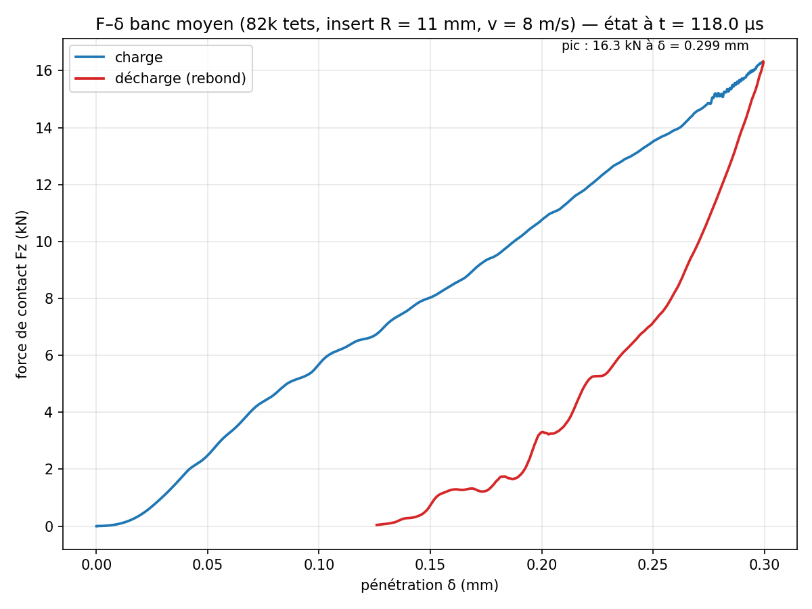
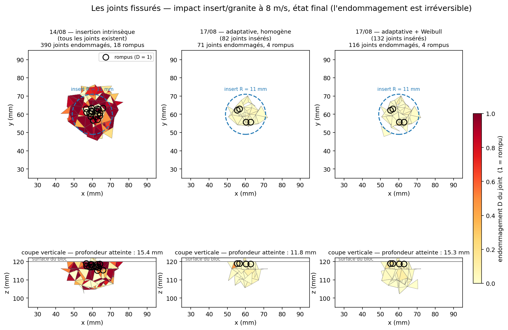

# figures_impact : dépouillement des premiers impacts 3D (banc P1, 14-17 août 2026)

## 1. Objet

Figures, animations et scripts des premiers calculs d'impact 3D de rockim : un insert sphérique de carbure (R = 11 mm) frappe à 8 m/s un bloc de granite de 120 mm de côté. Les figures ont été rapatriées le 17 août 2026 depuis un dossier temporaire de session que Windows pouvait vider.

Questions : le contact insert-roche est-il propre et suit-il la solution de Hertz ? La réponse de contact converge-t-elle au maillage ? Où et comment le bloc se fissure-t-il selon la résistance, le maillage et le schéma d'insertion ?

## 2. Statut

Archive du 14 au 17 août 2026. Ces calculs précèdent la correction de `jointNormalProxy`, le cliquet de décharge, la réplique St Anne de septembre et la correction du contact du 7 octobre 2026 (`docs/rapport_guide/ENQUETE_CONTACT.md`), qui n'a pas été appliquée ici. Ce qui reste valable : les branches de charge élastiques (contact contre Hertz, convergence au maillage), qui ne dépendent ni des joints ni du contact entre fragments ; les faciès de fissuration sont à lire comme une étape historique. L'impact court contre Hertz a été rejoué le 6 octobre 2026 avec le binaire courant : ce sont ces chiffres qui font foi (rapport-guide, chapitre 6).

## 3. Résultat principal

- Banc moyen (82 k tétraèdres) : force de contact maximale 16,3 kN à 0,299 mm de pénétration, courbe de charge sans bruit (bruit RMS 0,1 % du pic contre 7,0 % pour le contact par pénalité d'Abaqus en 2D) (`banc_mid_fdelta.png`, `compare_fdelta_abaqus_rockim.png`).
- Contre Hertz, la force mesurée vaut 0,75 à 1,3 fois l'analytique selon le maillage, et le pic local de von Mises (266 à 2 931 MPa) reste loin de p₀ = 4 114 MPa : la réponse globale suit Hertz, le pic local n'est pas résolu (`hertz_compare.png`). Le rejeu du 6 octobre chiffre le contact maillé 1,7 à 1,9 fois plus raide que Hertz quand le rayon de contact n'est pas résolu.
- Fissuration : avec ft = 10 MPa (ℓ_cz = 35 mm, hors de la fenêtre de résolution), 4 joints rompus en adaptatif et 18 en intrinsèque ; avec ft = 87 MPa et une maille de 0,46 mm (ℓ_cz = 1,0 mm), 1 057 joints rompus sur 4,3 mm de profondeur (`joints_fissures.png`).

## 4. Figures

Force de contact contre pénétration du banc moyen (82 k tétraèdres, insert R = 11 mm à 8 m/s) : charge, puis décharge au rebond.

Joints endommagés à l'état final, vue de dessus et coupe : à gauche et au centre ft = 10 MPa (zone cohésive non résolue), à droite ft = 87 MPa sur maillage de 0,46 mm.

## 5. Contenu du dossier

Calculs dépouillés (sorties hors dépôt, dans `../out_*` sur le poste du doctorant) :

| calcul | configuration | description |
|---|---|---|
| `out_smoke` | `configs/smoke_impact.cfg` | dégrossissage multifil, 6 trames |
| `out_banc_mid` | `configs/p1_banc_mid.cfg` | banc de référence : bloc de 120 mm, insert R = 11 mm à 8 m/s, environ 82 k tétraèdres, T = 1,2e-4 s (contact, charge-décharge, rebond), environ 1 h 30 |
| `out_p1_1t` | `configs/p1_banc.cfg` | mesure de performance, 842 k tétraèdres, 1 fil, 1 trame |
| `out_elast_*` | balayage élastique | quatre maillages (82 k et 259 k uniformes, gradués 1,5 et 0,7 mm), ft = 1e12 |
| `out_imp3d_homog`, `out_imp3d_weib`, `out_imp3d_ultra`, `out_imp3d_sz_*` | impacts du 17 août | adaptatif homogène, Weibull, ft = 87 MPa, effet d'échelle |

Figures :

| fichier | contenu |
|---|---|
| `banc_mid_fdelta.png`, `banc_mid_progress.png` | force-pénétration et avancement du banc moyen |
| `compare_fdelta_abaqus_rockim.png` | bruit du contact : pénalité d'Abaqus (FDEM 2D, juin 2026) contre potentiel de rockim (cas différents, on compare le bruit) |
| `banc_mid_impact.gif`, `impact_f5.png` | l'impact en coupe, 6 trames |
| `banc_mid_topview.gif`, `topview_f3.png` | vue de dessus avec le maillage |
| `banc_mid_impacted*.gif`, `banc_mid_impacted*_f5.png` | éléments touchés, variante enveloppe |
| `smoke_impact.png`, `p1_progress.png` | calcul de dégrossissage, avancement du calcul P1 |
| `hertz_compare.png`, `convergence_contact.png`, `meshes_contact.png`, `elast_stress.png` | contact contre Hertz, convergence de la raideur de contact, maillages du balayage, von Mises à pénétration égale |
| `compare_adap_homog_weib.png`, `imp3d_homog.png`, `imp3d_weib.png` | insertion intrinsèque du 14 août contre adaptative homogène et Weibull du 17 août |
| `compare_sizeeffect.png`, `imp3d_sz_homog_mid.png` | effet d'échelle de Weibull sur deux maillages |
| `ultra_courbes.png`, `imp3d_ultra.png`, `ultra_impacted*.gif`, `ultra_impacted*_last.png` | calcul ft = 87 MPa, ℓ_cz = 1,0 mm |
| `joints_fissures.png`, `modes_rupture_ultra.png`, `mode_mode*_ultra.png`, `env_elem_mode*_ultra.png` | joints fissurés, modes I et II, enveloppes par éléments |

Scripts (un par figure, `plot_*.py`, `compare_*.py`, `gif_*.py`) et données locales `history_mid.csv`, `history_snapshot.csv`.

## 6. Rejouer

Les scripts se lancent sans argument depuis ce dossier et trouvent seuls leurs entrées :

| script | lit | écrit |
|---|---|---|
| `plot_fdelta.py`, `plot_mid.py` | `history_mid.csv` (local) | `banc_mid_fdelta.png`, `banc_mid_progress.png` |
| `plot_p1_progress.py` | `history_snapshot.csv` (local) | `p1_progress.png` |
| `plot_smoke.py` | `../out_smoke/history.csv` | `smoke_impact.png` |
| `gif_banc_mid.py`, `gif_topview.py`, `gif_impacted.py` (option `--envelope`) | VTU de `../out_banc_mid` | les GIF |
| `compare_abaqus_rockim.py` | npz Abaqus et `history_mid.csv` | la comparaison |
| `plot_hertz.py`, `plot_convergence_contact.py`, `plot_meshes_contact.py`, `plot_elast_stress.py` | `../out_elast_*` | figures du balayage élastique |
| `compare_*.py`, `plot_imp3d_homog.py`, `plot_ultra_courbes.py`, `plot_modes_rupture.py`, `plot_mode_enveloppe.py`, `plot_enveloppe_elements.py`, `plot_joints_fissures.py` | `../out_imp3d_*`, `../out_banc_mid` | figures du 17 août |

Seuls `plot_fdelta.py`, `plot_mid.py` et `plot_p1_progress.py` tournent sans les sorties de calcul. L'impact court rejoué contre Hertz est au chapitre `docs/rapport_guide/sections/r06_impact.tex` (« Impact court et solution de Hertz »), dans [rapport_guide_rockim.pdf](../docs/rapport_guide/rapport_guide_rockim.pdf).

Notes du rapatriement (17 août) :

- Chemins morts corrigés : `plot_smoke.py` pointait sur un ancien clone et les trois `gif_*.py` sur un dossier temporaire ; ils lisent désormais `../out_smoke` et `../out_banc_mid`.
- `out_banc_mid/history.csv` a sa dernière ligne tronquée (26 colonnes au lieu de 28) : le calcul a été interrompu sans vidage du tampon. Les `gif_*.py` lisent avec `invalid_raise=False` et l'ignorent ; la copie locale `history_mid.csv`, prise pendant le calcul, est intacte. Comportement de rockim noté à l'époque : pas de garantie de vidage de `history.csv` à l'arrêt.
