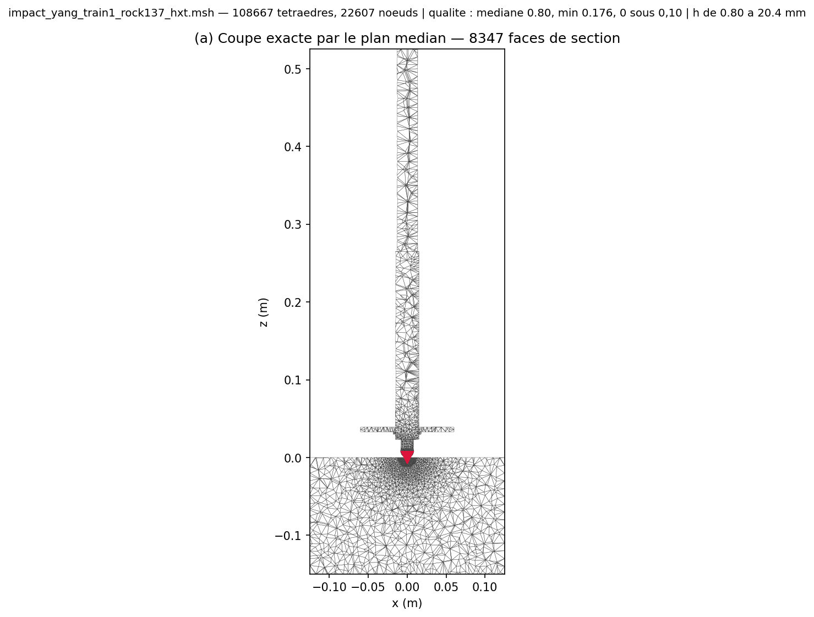

# meshes/ — maillages Gmsh

Maillages au format Gmsh MSH 2.2 lus par les decks (`mesh = file`, `meshFile = meshes/<nom>.msh`).
Les maillages sont générés : le `.gitignore` exclut `*.msh` et la commande qui les reproduit figure
en tête de chaque deck. Seuls six fichiers sont versionnés, parce que des tests en dépendent et
doivent pouvoir être rejoués depuis un clone. Les decks de `configs*/` citent une cinquantaine d'autres maillages
(`impact_yang_train1_rock137_hxt.msh` pour St Anne, `impact_yang_s1_pose.msh` pour Kuru…), à
régénérer avec `tools/make_*_mesh.py` avant de lancer.

## Maillages versionnés

| Fichier | Taille | Nœuds | Tétraèdres (3D) ou triangles (2D) | Objet | Utilisé par |
|---|---:|---:|---:|---|---|
| `bench1_insert.msh` | 0,8 Mo | 4 109 | 17 873 tétraèdres | insert sphérique maillé sur une éprouvette (banc P1) | `configs/fdem3d_bench1_insert.cfg` (suite de tests), `configs/p1_banc.cfg` |
| `box3d_h45.msh` | 1,0 Mo | 4 293 | 19 326 tétraèdres | bloc 80 × 80 × 60 mm non structuré, h = 4,5 mm | `configs/fdem3d_percussion_base.cfg` (suite de tests), `_weibull`, `_pulv` |
| `cut3d_h50.msh` | 0,9 Mo | 3 859 | 18 596 tétraèdres | bloc de coupe PDC 3D | `configs/cut3d_heilman.cfg`, `_cut3d_*`, bit-identité `tests_f2/bitid/` |
| `impact_kuru_s15.msh` | 1,8 Mo | 8 806 | 39 734 tétraèdres | impact Kuru, maillage pilote s = 1,5 | bit-identité `tests_f2/bitid/fdem3d_kuru9_court.cfg`, bancs `tests_f2/campagne13/S1/` |
| `loads_bar_h4.msh` | 0,08 Mo | 477 | 1 662 tétraèdres | barre 20 × 20 × 40 mm avec groupes physiques nommés | `configs/verify_fdem3d_loads.cfg`, `verify_fem3d_loads.cfg`, `fdem3d_loads_rupture.cfg` (suite de tests) |
| `t1_toolcontact.msh` | 0,02 Mo | 192 | 334 triangles | bande 2D minuscule pour le contact outil | `configs/verify_fdem_toolcontact.cfg` (suite de tests), bit-identité |

## Générateurs

| Script | Maillages produits |
|---|---|
| `tools/make_unstructured_mesh.py` | blocs, barres et éprouvettes 2D et 3D (`box2d`, `box3d`, `box3dbc`, `bench1`, `tunnel`…) |
| `tools/make_impact_mesh.py` | train de frappe complet et roche pour St Anne et Kuru |
| `tools/make_impact2d_mesh.py`, `tools/make_impact3d_mesh.py` | impacts 2D et 3D plus anciens |
| `tools/make_cut_mesh.py`, `tools/make_cut3d_mesh.py` | coupe PDC 2D et 3D |
| `tools/mesh_quality.py` | contrôle de qualité d'un maillage existant |

## Exemple

Le maillage du run St Anne, non versionné, régénéré à graine fixe puis tracé par
`tools/fig_mesh3d.py` (coupe, zoom sous l'insert, gradation de taille) :

Commandes et commentaire : [`results/fig/config_stanne/LISEZMOI.md`](../results/fig/config_stanne/LISEZMOI.md).
