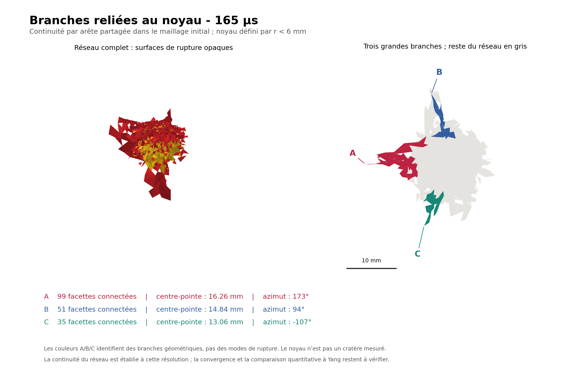

# output/ — analyses de fissuration du run St Anne

Post-traitements du run `out_stanne2025_rock137` (calcaire de St Anne frappé à 10,66 m/s, comparaison
à Yang et al. 2025). Aucun fichier du run n'y est modifié : chaque dossier lit les trames VTU, en tire
des figures (PDF vectoriel et PNG) et un fichier JSON de mesures et de provenance. 106 fichiers,
37 Mo.

## Contenu

| Dossier | Contenu | Script | Rôle |
|---|---|---|---|
| `pdf/stanne_ICL_165us/`, `_180us/`, `_192us/` | rendu comparable aux figures d'ICL : évolution de la fissuration, effet du mode de rendu, branches de rupture connectées | `tools/fig_icl_stanne_review.py` | `03_branches_connectees` de 165 µs est la figure `impact/stanne_branches_165` du rapport-guide |
| `pdf/stanne_surface_165us/`, `_180us/`, `_192us/` | traces de fissures sur la surface initiale et dans une coupe à -0,5 mm | `tools/fig_surface_compare.py` | analyse détaillée dans [`docs/notes/COMPARAISON_SURFACE_STANNE_165us.md`](../docs/notes/COMPARAISON_SURFACE_STANNE_165us.md) |
| `pdf/stanne_210us/` à `pdf/stanne_300us/` | les deux analyses précédentes, sous `ICL/` et `surface/`, aux instants 210, 225, 240, 255, 270, 285 et 300 µs | les deux mêmes | `surface/` de 300 µs est la figure `impact/stanne_surface_300` du rapport-guide ; les `surface/mesures.json` alimentent la planche `impact/stanne_synthese` |
| [`fragments_stanne/`](fragments_stanne/LISEZMOI.md) | animation des tétraèdres détachés jusqu'à 180 µs, dernière trame, vérification à 120 µs | `tools/animate_detached_rock.py` | illustration ; indices cinématiques, pas une preuve de vol libre |

Les états à 165 µs et 300 µs sont ceux que cite le rapport-guide ; les autres instants sont des
archives. L'analyse des fissures radiales à 165 µs est rédigée dans
[`docs/notes/FIGURES_ICL_STANNE_165us_2026-09-13.md`](../docs/notes/FIGURES_ICL_STANNE_165us_2026-09-13.md).

Les données numériques du run (historique, deck effectif) sont dans
[`results/data/stanne2025_rock137/`](../results/data/stanne2025_rock137/LISEZMOI.md) ; les autres
planches St Anne dans [`results/`](../results/README.md).
