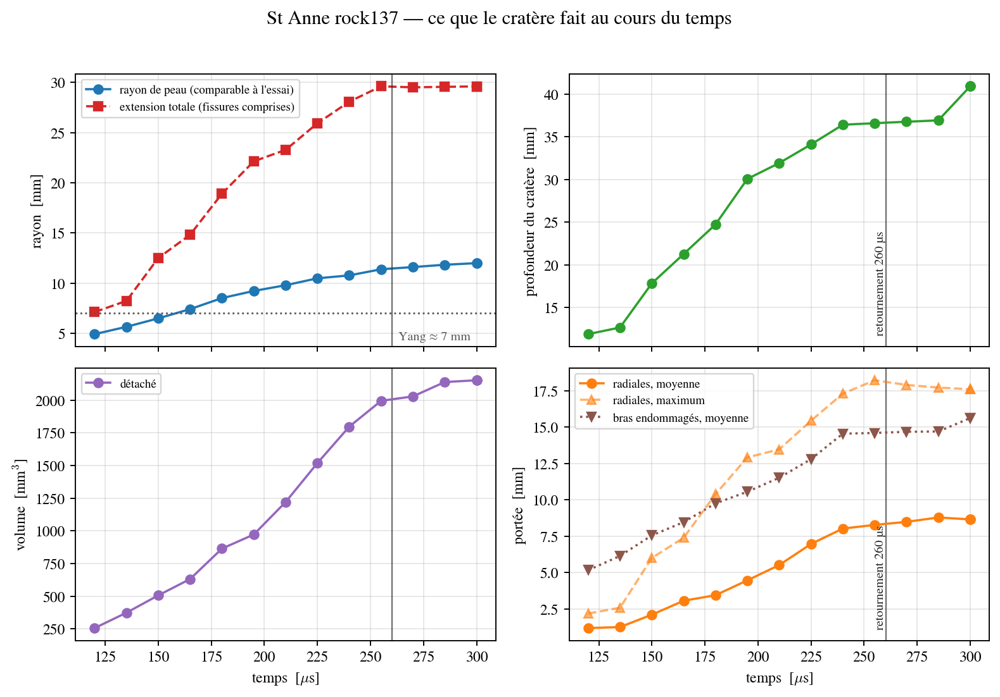

# results/ — données archivées, figures et empreintes de bit-identité

Le dossier garde ce qui reste d'un run une fois ses trames VTU supprimées : les données texte, les
figures tirées de ces données et les empreintes des binaires. Les dossiers de sortie bruts
(`out_*/`, plusieurs Go) ne sont pas versionnés. 405 fichiers, 120 Mo.

## Contenu

| Emplacement | Contenu | Nombre | Rôle |
|---|---|---:|---|
| [`data/stanne2025_rock137/`](data/stanne2025_rock137/LISEZMOI.md) | historique, trames, état final par élément, deck effectif et journal du run St Anne (14/09/2026, 29 h sur 14 fils) | 6 | archive de référence : porte tous les chiffres de la comparaison à Yang et al. 2025 |
| [`fig/config_stanne/`](fig/config_stanne/LISEZMOI.md) | montage du train de frappe et maillage du run St Anne | 9 | figures de description du calcul (le rapport-guide en inclut une version, `stanne_montage`) |
| `fig/stanne300/` | planches du run St Anne à 300 µs, fin du calcul : force-pénétration, cinétique, joints rompus, coupes, contrainte σ1, cratère, branches, retournement | 22 | source des figures St Anne du rapport-guide |
| `fig/stanne192/` à `fig/stanne295/` | les mêmes planches à des instants intermédiaires (192, 210, 225, 240, 255, 266, 270, 277, 285, 295 µs), produites pendant que le run avançait | 163 | archive |
| `fig/` (racine) | planches des runs Kuru (`s1_v3` = maillage fin, `s25_*` = bancs courts), des bancs A, B, D des 13-14/09 et des premières figures St Anne : `coupes_*`, `joints_*`, `fp_*`, `kinetics_*`, `cracks_*`, `crack_paths_*`, `stress_*`, avec leurs tables CSV | 164 | quatre planches Kuru alimentent le rapport-guide ; le reste est archive |
| `bitid_*.json`, `bitid_*.log.txt` | empreintes de bit-identité d'un binaire (`tools/bitid.py`, voir `tools/BITID.md`) : exécutable, SHA-256, date, écarts aux références | 21 | traçabilité des binaires `rockim_g0` à `rockim_g1y18` |
| `*.err` | sorties d'erreur, toutes vides, des runs `cal20_*`, `tx_gbm3_*` et `ucs_sw_*` de `configs_yan/` | 20 | archive |

## Ce qui alimente le rapport-guide

Les figures de [`docs/rapport_guide/figures/`](../docs/rapport_guide/) sont des copies. Leurs
sources dans ce dossier, vérifiées à l'identique :

| Figure du rapport-guide | Source |
|---|---|
| `stanne_evolution`, `stanne_fp`, `stanne_joints` | `fig/stanne300/evolution`, `fp`, `joints` |
| `impact/stanne_coupes`, `impact/stanne_retournement`, `impact/stanne_sig_coupe` | `fig/stanne300/coupes`, `retournement`, `sig_coupe` |
| `impact/kuru_coupes_adapt` | `fig/coupes_s25_adaptif_max_110us` |
| `impact/kuru_coupes_intr` | `fig/coupes_s25_intrinseque_80us` |
| `impact/kuru_crack_paths` | `fig/crack_paths_out_yang2026_v3` |
| `impact/kuru_kinetics` | `fig/kinetics_s1_s25` |

La planche de synthèse `impact/stanne_synthese` est recalculée par
`docs/rapport_guide/figures/impact/fig_stanne_synthese.py` à partir de
`data/stanne2025_rock137/history.csv`, du journal du solveur, de
`fig/stanne300/evolution_cache.json` et des `mesures.json` de [`output/`](../output/README.md).

## Refaire les figures

Les scripts sont dans `tools/` : `fig_fp.py`, `fig_fp_direct.py`, `fig_kinetics.py`,
`fig_joints_cuts.py`, `fig_joints_only.py`, `fig_stress_section.py`, `fig_retournement.py`,
`fig_evolution_cratere.py`, `crack_paths.py`. Les commandes sont données dans
[`data/stanne2025_rock137/LISEZMOI.md`](data/stanne2025_rock137/LISEZMOI.md). La liste commentée des
figures de septembre est dans
[`docs/notes/FIGURES_pour_le_rapport_2026-09-13.md`](../docs/notes/FIGURES_pour_le_rapport_2026-09-13.md).
