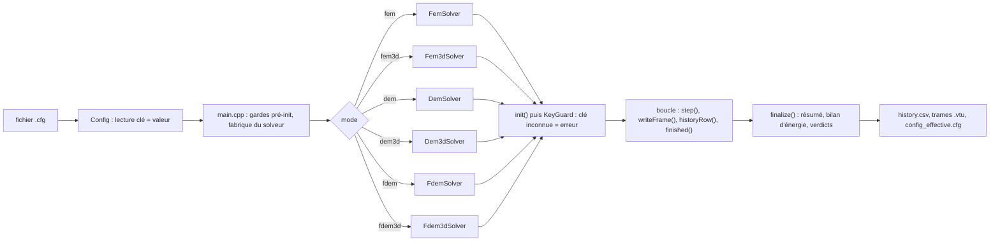
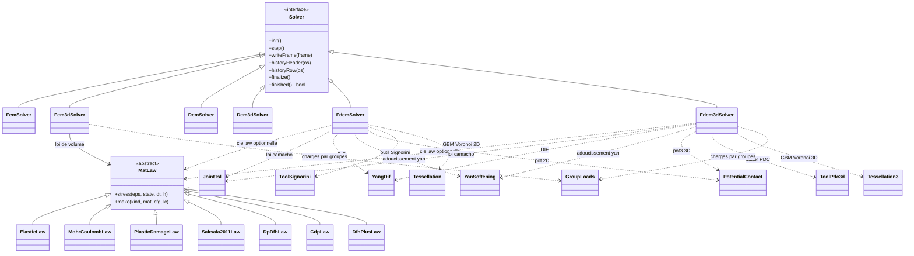
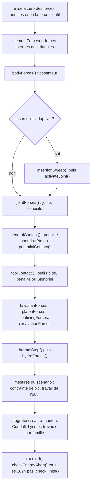
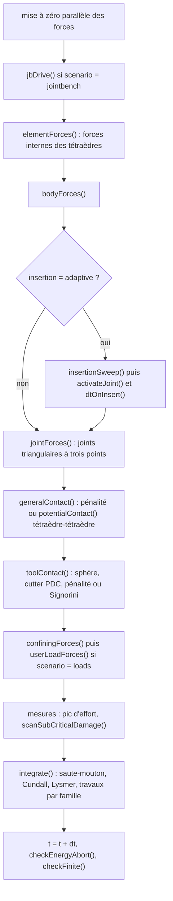

# Carte du code de rockim

Ce dossier contient les sources C++ (`src/*.cpp`) et renvoie aux en-têtes de `include/rockim/`. Les deux
sont décrits ici. Le code est en C++17, sans dépendance autre qu'Eigen et OpenMP. Toutes les grandeurs
sont en SI (m, kg, s, Pa, J). La convention de signe est la traction positive.

Les numéros de ligne cités sont ceux de la branche `claude/adoring-bardeen-qc4ovq` au 2026-10-07. Ils
sont approximatifs et bougent avec le code : chercher le nom de la fonction plutôt que la ligne.

Pour la physique, lire d'abord le chapitre de formulation du rapport guide
(`docs/rapport_guide/sections/r02_formulation.tex`, compilé dans
`docs/rapport_guide/rapport_guide_rockim.pdf`). Pour les clés de configuration, `DOCUMENTATION_rockim.md`
§5 ; pour la prise en main, `GUIDE_rockim.md`.

## 1. Vue d'ensemble

`rockim` est un seul exécutable. Le pilote `main.cpp` lit un fichier de configuration `clé = valeur`,
construit le solveur demandé par la clé `mode`, fait tourner la boucle en temps explicite et écrit
`history.csv` et les trames VTK. Six solveurs implémentent la même interface `Solver`.

| `mode` | Classe | Méthode | Dimension |
|---|---|---|---|
| `fem` | `FemSolver` | éléments finis explicites, triangles CST, endommagement et érosion | 2D déformation plane |
| `fem3d` | `Fem3dSolver` | éléments finis explicites, tétraèdres, lois `MatLaw` enfichables, érosion | 3D |
| `dem` | `DemSolver` | particules liées (BPM), liens parallèles | 2D |
| `dem3d` | `Dem3dSolver` | sphères et liens parallèles PFC3D | 3D |
| `fdem` | `FdemSolver` | éléments finis et discrets combinés (lignée Munjiza, Y2D) | 2D déformation plane |
| `fdem3d` | `Fdem3dSolver` | FDEM sur tétraèdres (lignée Y3D et Solidity) | 3D |

Les deux solveurs FDEM portent l'essentiel du travail de thèse. Les autres modes servent de comparaison
(continu endommageable contre FDEM) ou de bac à sable.

## 2. Architecture des classes

Les deux solveurs FDEM sont écrits en miroir : mêmes noms de fonctions, mêmes clés, mêmes noyaux
partagés. Une loi qui existe en 2D et en 3D appelle le même code (en-têtes `JointTsl.hpp`, `YangDif.hpp`,
`YanSoftening.hpp`) pour qu'aucune divergence ne s'installe par recopie. Le couplage hydro-mécanique, le
choc thermique et l'anisotropie de litage n'existent qu'en 2D ; les charges par groupes, le banc de joint
cinématique (`scenario = jointbench`) et le cutter PDC n'existent qu'en 3D.

## 3. Fichiers sources (`src/`)

| Fichier | Lignes | Rôle |
|---|---|---|
| `main.cpp` | 490 | Pilote. Sous-commandes `selftest-*`, `thermobench`, `matpoint` (l. 74-230). Gardes pré-init sur les clés incompatibles avec le mode (l. 235-306). Fabrique du solveur (l. 317-324). `init()` (l. 326), audit des clés par `KeyGuard` et écriture de `config_effective.cfg` (l. 342), `seal()` (l. 359). Boucle en temps : pas fixe ou pas variable, trames et lignes d'historique, arrêt anticipé par `finished()`, puis `finalize()` (l. 370-480). |
| `Config.cpp` | 243 | Lecteur `clé = valeur`. Chaque lecture marque la clé consommée, ce qui permet à `KeyGuard` de refuser les clés lues par personne. |
| `FdemSolver.cpp` | 11 900 | FDEM 2D complet : maillages, joints, insertion, contact, outil, essais (traction, brésilien, SHPB, triaxial), hydro-mécanique, thermique, excavation, bilan d'énergie, sorties. Contient aussi les bancs `selftest-potential2d`, `selftest-toolcontact`, `selftest-potcontact2d` (l. 10 741 et suivantes). |
| `Fdem3dSolver.cpp` | 8 880 | FDEM 3D : même structure que le 2D, sur tétraèdres. Banc de joint cinématique `jb*` (l. 8 155-8 450), `selftest-potential3d` et `selftest-potvolume3d` (l. 8 713). |
| `Fdem3dLoads.cpp` | 501 | Charges et conditions aux limites par groupes physiques Gmsh en fdem3d (`scenario = loads`, clés `fix.`, `velocity.`, `traction.`, `pressure.`, `force.`, `amplitude.`). |
| `Fem3dSolver.cpp` | 3 103 | Continu 3D explicite sur tétraèdres : forces internes déléguées à `MatLaw`, érosion, outil rigide (pénalité ou Signorini), frontières de Lysmer, sondes. |
| `Fem3dLoads.cpp` | 601 | Portage en fem3d des charges par groupes, mêmes clés et mêmes messages qu'en fdem3d. |
| `FemSolver.cpp` | 1 084 | Continu 2D CST : Drucker-Prager, coupure de Rankine, endommagement isotrope (`updateDamage`, l. 814), érosion. |
| `DemSolver.cpp` | 724 | DEM 2D : liens parallèles (`bondForces`, l. 371), contact frottant (`contactForces`, l. 418), fragments. |
| `Dem3dSolver.cpp` | 821 | DEM 3D : liens parallèles avec moments de flexion et de torsion, contact à ressort tangentiel avec historique, frontières absorbantes. |
| `MatLaw.cpp` | 5 511 | Lois de volume : `elastic`, `mc`, `dpr`, `saksala`, `saksala2011`, `dpdfh`, `cdp` ; fabrique `MatLaw::make` (l. 5 026) ; bancs `selftest-mc`, `-triax`, `-cdp`, `-fixed`, `-saksala2011`, `-dpdfh` ; pilote au point matériel `matpoint` (l. 4 408). |
| `MatLawDfhPlus.cpp` | 656 | Loi `dfhplus`, reconstruction de DP-DFH sur une énergie libre postulée. Séparée pour laisser `DpDfhLaw` intacte. |
| `DfhPlusBench.cpp` | 649 | Banc `selftest-dfhplus` au point matériel. |
| `ThermoBench.cpp` | 1 056 | Banc thermodynamique générique des lois (`rockim thermobench`) : symétrie de la tangente, dissipation positive, objectivité. |
| `Tessellation.cpp` | 1 026 | Grains de Voronoï 2D triangulés, avec phases minérales (modèle GBM). |
| `Tessellation3.cpp` | 625 | Grains de Voronoï 3D tétraédrisés. |
| `ToolPdc3d.cpp` | 240 | Banc en forme fermée `selftest-pdc3d` du cutter PDC 3D. |
| `VtkWriter.cpp` | 297 | Écriture des `.vtu` ASCII lus par ParaView (coordonnées en pleine précision). |

## 4. En-têtes (`include/rockim/`)

| En-tête | Contenu |
|---|---|
| `Solver.hpp` | Interface abstraite commune aux six solveurs. |
| `Config.hpp` | Classe `Config` : lecture du deck, suivi des clés consommées, `seal()`. |
| `KeyGuard.hpp` | Audit après `init()` : une clé du deck jamais lue est une erreur (obsolète, autre mode, faute de frappe, inconnue). Écrit `config_effective.cfg`. |
| `KeysByMode.hpp` | Registre des clés par mode, généré par `tools/gen_keys_by_mode.py` depuis `tools/keys_by_mode.json`. Ne pas éditer à la main. |
| `Guards.hpp` | Gardes des entrées : nœud orphelin, masse nulle, élément dégénéré ; détecteur de NaN et d'infinis (`checkFinite`). |
| `Material.hpp` | Carte matériau partagée (`Material`, `PhaseSet` pour les phases minérales). |
| `RandomField.hpp` | Champ aléatoire gaussien corrélé 2D et 3D, indépendant du maillage (hétérogénéité de résistance). |
| `Tool.hpp` | Outil rigide 2D : poinçon plat ou disque, libre ou à vitesse imposée. |
| `ToolSignorini.hpp` | Noyau pur de l'impulsion du contact outil de Signorini (schéma CD-Lagrange), `toolsig::impulse`. |
| `ToolPdc3d.hpp` | Géométrie exacte du cutter PDC 3D (cylindre chanfreiné, distance signée), `pdc3d::query`. |
| `FdemSolver.hpp` | Classe `FdemSolver` : structures `Elem` (l. 193), `Joint` (l. 254), `BEdge`, `Platen`, et noyau de frottement `jfric` (l. 141). |
| `Fdem3dSolver.hpp` | Classe `Fdem3dSolver` : `Elem` (l. 157), `Joint` (l. 203), `BFace`, `Tool3`, et `camachoFrictionSlider` (l. 123). |
| `Fem3dSolver.hpp`, `Fem3dKinematics.hpp` | Classe `Fem3dSolver` ; cinématique de Hencky (`kinematics = hencky`). |
| `FemSolver.hpp`, `DemSolver.hpp`, `Dem3dSolver.hpp` | Classes des solveurs annexes. |
| `MatLaw.hpp`, `MatLawDfhPlus.hpp` | Interface `MatLaw`, état `MatState`, description de chaque loi et de ses clés. |
| `JointTsl.hpp` | Noyau pur de la loi cohésive extrinsèque (`jointTSL = camacho`) : critère d'insertion elliptique `phiInsert`, tampon d'insertion `stampInsertion`, traction et endommagement, partition `split`, cap de cisaillement `shearCap`, mélange de Benzeggagh-Kenane. Partagé 2D et 3D. |
| `YanSoftening.hpp` | Adoucissement exponentiel f(D) de Yan et al. 2023 (z-curve de Munjiza), `yan::fD`. |
| `YangDif.hpp` | Facteurs d'amplification dynamique de Yang et al. 2025 (`difTensionYang`, `difCompressionYang`), partagés 2D et 3D. |
| `PotentialContact.hpp` | Contact par potentiel de Munjiza : `pot` (triangle-triangle, 2D) et `pot3` (tétraèdre-tétraèdre, 3D, et variante en volume `pairForceVolume`). Fonctions pures, troisième loi de Newton exacte. |
| `GroupLoads.hpp` | Briques communes des charges par groupes (fdem3d et fem3d) : nombres stricts, amplitudes, axes. |
| `Tessellation.hpp`, `Tessellation3.hpp` | Pipelines de Voronoï 2D et 3D. |
| `ThermoBench.hpp` | Options et usage du banc thermodynamique. |
| `VtkWriter.hpp` | Signatures des écrivains VTK. |

Les en-têtes des deux solveurs FDEM citent des lignes du code public de Solidity (« Y3D*.c l. NNNN »).
Ces numéros valent pour la version lue le 2026-08-26 ; l'en-tête de `FdemSolver.hpp` en donne les
précautions de lecture.

## 5. Déroulé d'un pas de temps en FDEM 2D (`FdemSolver::step`, l. 5 428)

| Étape | Fonction (l.) | Ce qui se passe |
|---|---|---|
| 1 | `elementForces` (5 632) | Pour chaque triangle : gradient de transformation F, décomposition polaire, déformation de Biot dans le repère co-rotationnel, contrainte élastique (ou `MatLaw` si `law` est posé, l. 5 682 ; ou néo-hookéen de Guo, l. 5 684), plafonds de contrainte, pulvérisation (l. 5 749), viscosité de volume, forces nodales. Le travail du pas est cumulé dans `elWork_` (l. 5 914). |
| 2 | `bodyForces` (5 947) | Pesanteur et travail associé. |
| 3 | `insertionSweep` (4 253), `activateJoint` (4 513) | En insertion adaptative : contrainte moyennée sur la facette, critère d'insertion (`insertionCriterion`, elliptique via `jtsl::phiInsert`), seuils amplifiés par le DIF, dédoublement des nœuds et naissance du joint, qui porte la traction dès ce pas. `stampDif` et `refreshDif` (4 213-4 252) figent le DIF du joint. |
| 4 | `jointForces` (6 131) | Pour chaque joint vivant : ouverture et glissement aux points d'intégration, loi cohésive, adoucissement, décharge, frottement, terme visqueux, forces nodales. Boucle parallèle avec réduction déterministe. Détail des lois en §7. |
| 5 | `generalContact` (7 576) | Mise à jour du jeu de faces actives (`activationSweep`, `rebuildContactEdges`) puis contact entre fragments : pénalité nœud-arête par défaut, ou `potentialContact` (7 212) sous `contact = potential`. |
| 6 | `toolContact` (7 892) | Outil rigide (plat, disque, coin de coupe) : pénalité par défaut ; `toolContact = signorini` (8 022) applique l'impulsion de `toolsig::impulse` (8 091). |
| 7 | chargements | `brazilianForces` (8 382), `platenForces` (8 229), `confiningForces` (8 411), `excavationForces` (9 157), `thermalStep` (9 053), `hydroForces` (8 849). Chacun est sans effet si sa clé est absente. |
| 8 | mesures | Contrainte nominale et verrouillage du pic en traction et au brésilien, force et travail de l'outil en percussion (5 487-5 595). |
| 9 | `integrate` (9 209) | Schéma explicite saute-mouton (Euler symplectique : v ← v + dt f/m, puis u ← u + dt v). En insertion adaptative, les copies d'un même sommet encore liées s'intègrent comme un seul nœud. Amortissement local de Cundall, frontières absorbantes de Lysmer, conditions imposées. Chaque famille de forces cumule son travail pour le bilan. |
| 10 | contrôles | `checkEnergyAbort` (8 303) tous les 1 024 pas si `budgetAbortPct` est posé ; `checkFinite` (5 609) tous les `nanCheckEvery` pas. |

Le pas `dt` est fixé une fois par `computeStableDt` (5 227) : condition de Courant sur les éléments, les
joints et le contact, multipliée par `dtFactor`.

## 6. Déroulé d'un pas de temps en FDEM 3D (`Fdem3dSolver::step`, l. 4 254)

L'ordre est celui du 2D. Les différences sont listées ci-dessous.

| Étape | Fonction (l.) | Ce qui se passe |
|---|---|---|
| 1 | `elementForces` (4 472) | Tétraèdre co-rotationnel (Biot), `MatLaw` si `law` est posé (l. 4 519), néo-hookéen (l. 4 520), pulvérisation de Yang 2026 (l. 4 571, travail dans `bdWork_`). |
| 2 | `insertionSweep` (3 328), `activateJoint` (3 530), `dtOnInsert` (3 640) | Contrainte et taux de la facette (`facetStress`, `facetEdot`, `facetRates`, l. 3 238-3 330), critère `jtsl::phiInsert` (l. 3 477), DIF (`stampDif`, l. 3 194). |
| 3 | `jointForces` (4 725) | Joint triangulaire à trois points d'intégration ; branche `camacho` (l. 4 793-5 010), Solidity (5 121), sécante à l'origine (5 201), Yan (5 270), règle de mort du joint (5 546). |
| 4 | `generalContact` (6 397), `potentialContact` (5 893) | Contact par potentiel tétraèdre-tétraèdre (`pot3::pairForce`, l. 6 227 ; `pairForceVolume` sous `potForce = volume`). Forces entre corps nommés (`contactForcePairs`). |
| 5 | `toolContact` (6 706) | Sphère ou cutter PDC (`pdc3d::query`, l. 6 741), pénalité ou Signorini (l. 6 884). |
| 6 | `userLoadForces` (`Fdem3dLoads.cpp`, l. 386) | Charges par groupes. |
| 7 | `integrate` (6 904) | Même schéma qu'en 2D. |
| 8 | `computeStableDt` (3 993) | Pas critique ; sous `camacho`, budget de la raideur de charge du joint. |

## 7. Où se trouve chaque loi

| Loi | 2D (`FdemSolver.cpp`) | 3D (`Fdem3dSolver.cpp`) | Noyau partagé |
|---|---|---|---|
| Élasticité co-rotationnelle (Biot), défaut `bulkModel = corotational` | `elementForces`, l. 5 624-5 700 | `elementForces`, l. 4 472 | — |
| Néo-hookéen de Guo 2014 éq. 2.6, `bulkModel = neohookean` | l. 5 684, 5 876-5 905 | l. 4 520 | — |
| Lois de volume plastiques et endommageables (`law = dpr`, `saksala`, `dpdfh`, `cdp`…) | appel l. 5 682 | appel l. 4 519 | `MatLaw.cpp`, `MatLawDfhPlus.cpp` |
| Joint cohésif intrinsèque, pénalité et branche élastique (`jointElastic`) | `jointForces`, traction normale l. 6 428-6 584 | `jointForces`, l. 4 725 | — |
| Adoucissement linéaire (défaut) | `jointForces`, l. 6 495-6 540 | `jointForces` | — |
| Adoucissement de Yan / Munjiza, `jointSoftening = yan` | l. 6 476-6 530, cap l. 6 603 | l. 5 270, 5 359 | `YanSoftening.hpp` |
| Loi extrinsèque initialement rigide, `jointTSL = camacho`, mélange `jointMixLaw = bk` | l. 6 263-6 300 ; frottement `jfric` | l. 4 793-5 010 ; `camachoFrictionSlider` | `JointTsl.hpp` |
| Décharge normale sur la sécante à l'origine (éq. 17) | l. 6 520-6 535 | `jointForces` | — |
| Décharge en cisaillement, `jointShearUnload` (`plastic`, `origin`, `solidity`) | l. 6 302 (solidity), 6 360 et 6 709 (origin), 6 730 (retour radial) | l. 5 121, 5 201, 5 514 | — |
| Frottement de Coulomb et frottement résiduel (`jointResidualMu`) | l. 6 603-6 650 | l. 5 359 et suivantes | `jtsl::shearCap` |
| Terme visqueux du joint (option B, éq. 20) | l. 6 585, 6 757 | `jointForces` | `jtsl::viscous` |
| Critère d'insertion adaptative | `insertionSweep`, l. 4 253-4 500 | `insertionSweep`, l. 3 328 | `jtsl::phiInsert` |
| DIF de Yang 2025 (`strainRateDIF`, `difExpT`, `difExpS`) | `stampDif`, `refreshDif`, l. 4 213-4 252 ; armement l. 6 156 | l. 3 194-3 237 | `YangDif.hpp` |
| Pulvérisation de Yang 2026, `bulkDamage = yang` | `elementForces`, l. 5 749 | `elementForces`, l. 4 571 | — |
| Contact par pénalité entre fragments | `generalContact`, l. 7 576 | `generalContact`, l. 6 397 | — |
| Contact par potentiel de Munjiza, `contact = potential` | `potentialContact`, l. 7 212 | `potentialContact`, l. 5 893 | `PotentialContact.hpp` |
| Contact outil de Signorini, `toolContact = signorini` | `toolContact`, l. 8 022-8 160 | `toolContact`, l. 6 884 | `ToolSignorini.hpp` |
| Cutter PDC 3D, `toolShape = pdc` | coin 2D dans `toolContact` | `toolContact`, l. 6 732-6 840 | `ToolPdc3d.hpp` |
| Hydro-mécanique, `hydro = on` (2D seulement) | `setupHydro` 8 439, `updateWetBoundary` 8 589, `hydroForces` 8 849 | — | — |
| Choc thermique, `thermal = on` (2D seulement) | `setupThermal` 8 938, `thermalStep` 9 053 | — | — |
| Anisotropie de litage (Lisjak, 2D seulement) | `setupBeddingElastic` 2 966, `applyBeddingCohesive` 3 078, `applyWeakPlanes` 3 142 | — | — |
| Statistique des joints (Weibull, effet d'échelle) | `applyJointStatistics` 2 828, `applyJointSizeEffect` 3 320 | 2 907, 3 017 | `RandomField.hpp` |

## 8. Bilan d'énergie V2/B4

Chaque famille de forces cumule son travail à chaque pas, en lecture pure, sans toucher aux forces :
éléments (`elWork_`), joints (`jointWork_`), contact (`gcWork_`), outil (`toolWork_`), amortissement de
Cundall (`cundWork_`), frontières de Lysmer (`lysWork_`), conditions imposées (`bcWork_`), confinement
(`confWork_`), hydro (`hydroWork_`), pesanteur. Le pas compte aussi le travail positif par canal
(`jointWorkPos_`, `gcWorkPos_`, l. 5 450-5 470), qui détecte une pompe d'énergie que le bilan net ne
verrait pas.

À la fin du calcul, `finalize` (2D l. 10 134-10 180 ; 3D l. 7 746) imprime
`energy budget (V2/B4)` : variation d'énergie cinétique, travail de chaque famille, résidu
ΔKE − ΣW et verdict relatif au flux brut échangé. Les colonnes `eEl, eJnt, eGc, eFric, eCund, eLys` de
`history.csv` donnent le même bilan au fil du temps. `checkEnergyAbort` arrête le calcul quand le
résidu dépasse `budgetAbortPct`.

## 9. Sorties

| Sortie | Fonction | Contenu |
|---|---|---|
| `history.csv` | `historyHeader`, `historyRow` (2D l. 9 784, 9 871 ; 3D l. 7 532, 7 570) | une ligne par trame ou par `historyEvery` pas : temps, forces, joints rompus, énergies |
| `fdem_NNNN.vtu`, `fdem_joints_NNNN.vtu` (et `fdem3d_*`) | `writeFrame` (2D l. 9 535 ; 3D l. 7 332) | champs par élément (contraintes, `pMean`, fragment, grain) et par joint (`damage`, `tBreak`, `breakMode`, `dead`, `openMax`) |
| `frames.csv` | `main.cpp` | temps et pose de l'outil de chaque trame |
| `config_effective.cfg` | `KeyGuard` | deck réellement lu, valeurs par défaut comprises |
| résumé console | `finalize` | verdicts, pic, bilan d'énergie, fragments (`computeFragments`) |

Description des colonnes : `DOCUMENTATION_rockim.md` §6.

## 10. Pour aller plus loin

| Document | Contenu |
|---|---|
| `DOCUMENTATION_rockim.md` | référence complète : compilation, clés (§5), sorties (§6), pièges (§8) |
| `GUIDE_rockim.md` | prise en main pas à pas, une simulation d'impact de A à Z |
| `docs/rapport_guide/` | rapport guide ; formulation dans `sections/r02_formulation.tex`, vérification dans `r03_verification.tex` |
| `docs/rapport_guide/NOTE_INSERTION.md` | insertion des joints, comparaison terme à terme avec Yan 2023, Munjiza et Wang |
| `docs/rapport_guide/correction_contact/` | correction du contact par potentiel : littérature, implémentation, tests, revue |
| `docs/VV_campagne.md` et `vv/` | campagne de vérification et de validation |
| `tools/README.md` | suite de non-régression et outils de dépouillement |
