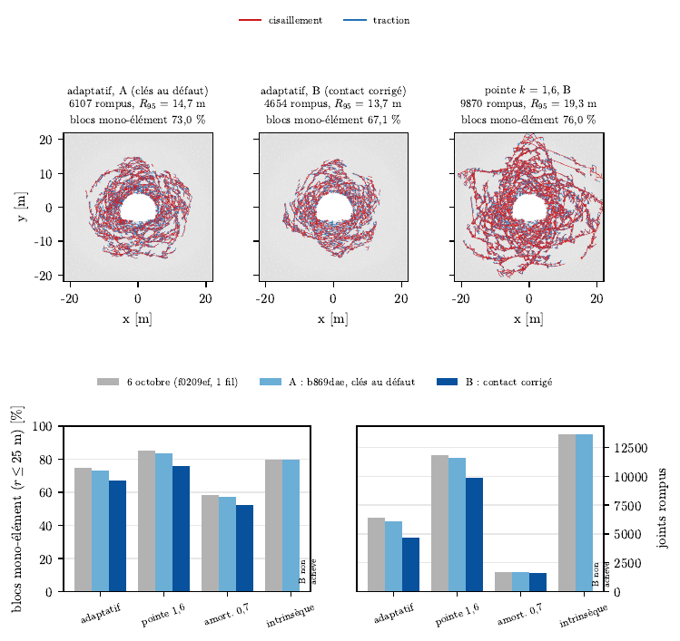
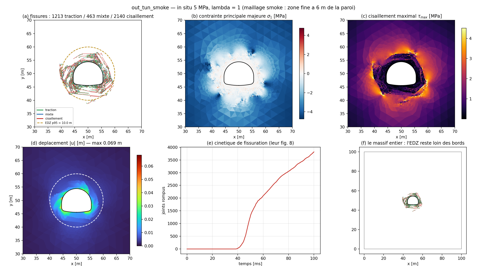

# tunnel_edz : zone endommagée autour d'un tunnel (reproduction de Wang et al. 2024)

## 1. Objet

Reproduction de l'excavation du tunnel routier de Hutou Beishan simulée par Wang, Qiao, Zheng, He, Hu et Yan avec MultiFracS (Front. Earth Sci. 12:1517816, 2024) : massif de 100 × 100 m sous contrainte in situ, tunnel en fer à cheval, excavation par relâchement de la traction de paroi. Deux capacités ont été ajoutées pour l'occasion (précontrainte `insituSh`, `insituSv` ; excavation `excavRelease`).

Question : rockim retrouve-t-il le rayon de la zone endommagée (EDZ, 19 m), la prédominance du cisaillement, les fissures conjuguées et l'effet du rapport λ, et la texture en blocs de MultiFracS ?

Le dossier sert aussi de boîte à outils commune : ses `tools/` (maillages, métriques d'EDZ, tailles de blocs) et une partie de ses `configs/` (coupe 2D, impacts, indentation) sont utilisés par d'autres études.

## 2. Statut

| date | état |
|---|---|
| 17 août 2026 | patchs in situ et excavation appliqués, contrôles analytiques V1 et V2 validés |
| août 2026 | cas de référence (0,25 s, 44 min), balayages σ₀ et λ, variantes d'insertion, de désordre, de facteur de pointe et d'amortissement |
| 6 octobre 2026 | rejeu partiel sur maillage réduit (22 730 triangles) avec le binaire courant |
| 7 octobre 2026 | rejeu avec le contact corrigé (`docs/rapport_guide/rejeu_tunnel_fix/RESULTATS.md`) |

Étude terminée, conclusions conditionnelles. L'enquête du 7 octobre (`docs/rapport_guide/ENQUETE_CONTACT.md`) a montré que le contact par potentiel injectait de l'énergie : des paires de triangles à sommet commun naissaient en recouvrement profond. La correction est optionnelle (`contactCandidates = vertex`, `gcBirth = offset`, `potForceExact = true`). Ce qui reste valable :

- les contrôles analytiques (charge nulle, Kirsch à 1,7 et 2,1 %) ne dépendent pas du contact ;
- les chiffres d'août en taille réelle (rayon d'EDZ, joints rompus) viennent de calculs qui injectaient de l'énergie et n'ont pas été rejoués en taille réelle avec le contact corrigé ;
- sur maillage réduit, le contact corrigé retire environ 24 % des joints rompus et 6 à 7 % du rayon d'EDZ en adaptatif, mais l'anneau reste granulé ; le facteur de pointe k = 1,6 augmente toujours la fissuration (×2,12 de joints rompus) ; le calcul intrinsèque corrigé n'a pas tenu dans le budget.

## 3. Résultat principal

- Contrôles : charge nulle in situ, énergie cinétique 1,97·10⁻¹⁷ J/m et 0 joint rompu ; Kirsch à 1,7 % (λ = 1) et 2,1 % (λ = 0,5) (§8 ci-dessous).
- Cas de référence (σ₀ = 5 MPa, λ = 1, `ref_iso_metrics.json`) : 14 935 joints rompus, rayon d'EDZ 17,19 m au maximum et 14,49 m au quantile 95 % contre 19 m chez Wang (−9,5 et −24 %), déplacement maximal 0,389 m sur un bloc détaché.
- Balayage σ₀ (`s3` à `s7_metrics.json`) : 3 356, 9 123, 20 028 et 24 535 joints rompus à 3, 4, 6 et 7 MPa ; rayon maximal 12,8 à 18,6 m.
- Rejeu avec contact corrigé (`docs/rapport_guide/rejeu_tunnel_fix/RESULTATS.md`, maillage réduit) : adaptatif 4 654 joints rompus contre 6 107, R_EDZ p95 13,73 contre 14,67 m, blocs mono-élément 67,1 % contre 73,0 % ; l'énergie de naissance tombe de 0,84 MJ/m à 93 J/m.

## 4. Figures



Rejeu du 7 octobre sur maillage réduit. En haut : fissures de l'adaptatif avant (A) et après (B) correction du contact, puis du facteur de pointe k = 1,6 avec contact corrigé. En bas : part de blocs mono-élément et joints rompus par variante. Aperçu converti depuis `docs/rapport_guide/figures/tunnel/fig_tunnel_fix.pdf`.



Calcul de dégrossissage (in situ 5 MPa, λ = 1, maillage léger) : fissures par mode, contraintes, déplacement et cinétique de fissuration.

## 5. Contenu du dossier

| chemin | contenu |
|---|---|
| `PATCH_1_insitu.md`, `PATCH_2_excavation.md` | les deux patchs C++ (précontrainte, relâchement de cavité), appliqués le 17 août |
| `REVUE_insertion_adaptative.md` | revue et mesures : pourquoi l'insertion adaptative diffuse (28 000 joints rompus contre environ 10 000 chez Wang) |
| `exo_tunnel_inventaire.md` | inventaire du banc 6 Abaqus (cavité pressurisée DP-DFH), voir `exo_tunnel/` |
| `biblio/` | copie des six volets de `biblio_insertion/` |
| `configs/verif_*.cfg` | V1 (charge nulle in situ) et V2 (Kirsch, λ = 1 et 0,5) |
| `configs/tunnel_smoke*.cfg`, `tunnel_ref_s5_lam1*.cfg` | dégrossissage et cas de référence (variantes Weibull, stabilisée) |
| `configs/sweep/` | balayages σ₀ = 3 à 7 MPa et λ = 0,5 à 1,5, `run_sweep.cmd` |
| `configs/tunnel_intrinseque.cfg`, `tunnel_tip1*.cfg`, `tunnel_tip20.cfg`, `tunnel_corr_th*.cfg`, `tunnel_dpdfh.cfg` | variantes : insertion intrinsèque, facteur de pointe, champ corrélé, continu DP-DFH |
| `configs/cut2d_*.cfg` | coupe 2D par un outil PDC (Heilman et al.), voir chapitre « coupe » |
| `configs/imp*`, `impact_*`, `indent*`, `perc2d_*`, `v3d_*`, `ucs_*` | impacts, indentation, percussion 2D, contrôles de compression, utilisés par d'autres études |
| `*_metrics.json`, `sweep_progress.txt` | métriques extraites (référence, balayage, dégrossissage) |
| `tools/` | maillages (`make_circle_mesh.py`, `make_cut_mesh.py`, `make_impact_mesh*.py`), métriques (`edz_metrics.py`, `block_sizes.py`, `crack_*.py`, `nucleation_vs_propagation.py`, `wall_*.py`), `kirsch_check.py`, `make_configs.py`, figures du rapport (`fig_*.py`) |
| `plot_*.py`, `fig_*.py`, `make_gif*.py`, `gif_*.py` | planches et animations (tunnel, coupe, impacts) |
| `out_tun_smoke_planche.png`, `tunnel_mesh_check.png`, `fig_tunnel_fix_apercu.png` | figures |

## 6. Rejouer

Depuis la racine du dépôt (les maillages sont générés, pas versionnés ; le maillage réduit `tunnel_hs_red.msh` est dans `docs/rapport_guide/simulations_a_lancer/meshes/`) :

```sh
build/rockim tunnel_edz/configs/verif_kirsch_lam1.cfg out_kirsch_lam1
python3 tunnel_edz/tools/kirsch_check.py out_kirsch_lam1
build/rockim tunnel_edz/configs/tunnel_ref_s5_lam1.cfg out_tun_ref
python3 tunnel_edz/tools/edz_metrics.py out_tun_ref
```

Pour le rejeu avec le contact corrigé, ajouter en fin de configuration `contactCandidates = vertex`, `gcBirth = offset`, `potForceExact = true` (decks du rejeu : `docs/rapport_guide/simulations_a_lancer/configs/tunnel/`). Chapitre du rapport-guide : `docs/rapport_guide/sections/r05c_tunnel.tex`, dans [rapport_guide_rockim.pdf](../docs/rapport_guide/rapport_guide_rockim.pdf).

## Dossier d'étude d'origine (17 août 2026)


Dossier d'étude préparé le 2026-08-17. Les deux patchs C++ ont été appliqués et validés le jour même (§8 ci-dessous).

Référence : Y. Wang, J. Qiao, S. Zheng, Z. He, Y. Hu, C. Yan, *Application of
FDEM in the study of large deformation mechanisms in deep-buried soft rock
tunnels: a case study*, Front. Earth Sci. 12:1517816 (2024). Code utilisé
par les auteurs : MultiFracS (C. Yan) — la même lignée que la loi
`jointSoftening = yan` et l'insertion adaptative déjà portées ici.

---

### 1. Ce qui existe déjà, ce qu'il faut ajouter

| Besoin de l'article | Dans rockim |
|---|---|
| FDEM 2D triangles + joints cohésifs mode I/II/mixte | natif |
| Adoucissement, décharge sécante (leur fig. 2) | `jointSoftening = yan`, `jointShearUnload = origin` |
| Maillage Gmsh gradué, tunnel en fer à cheval | `meshes/tunnel_hs.msh` (fait) |
| Frontières bloquées en direction normale | déjà là : `lateralRollers` (flancs, `ROLLERX`) + `gripLateralFree` avec `pullV = 0` (haut/bas : `uy = 0`, `ux` libre) |
| Classement traction / cisaillement / mixte | `bmode`, `rnB`, `rsB` déjà écrits dans `fdem_final_joints.csv` → post-traitement Python, aucun C++ |
| Déplacement max, EDZ, longueur de fissures | post-traitement des VTU + du CSV joints |
| Contrainte in situ (σ_h, σ_v), λ ≠ 1 | PATCH 1 |
| Excavation | PATCH 2 |

Deux patchs, une trentaine de lignes de physique en tout.

### 2. Pourquoi ce choix de méthode d'excavation

Wang et al. donnent au noyau une résistance artificielle pendant la mise en
place de l'in situ, puis réduisent progressivement son module (*core
modulus reduction*, Farrokh et al. 2006). Transposer ça exigerait les groupes
physiques en 2D (aujourd'hui 3D seulement) et un module variable en cours
de calcul.

Le patch 2 fait l'équivalent par le chemin standard des codes de tunnel — la
méthode convergence-confinement : le massif est maillé *avec* sa cavité et
pré-contraint ; les faces de la paroi portent donc à t = 0 une traction
déséquilibrée, exactement celle qu'exerçait la roche excavée. On la rétablit
(facteur de relâchement = 1, état initial rigoureusement en équilibre),
puis on la fait décroître jusqu'à zéro. Même état initial, même état final,
sans faire varier un module.

La traction appliquée est σ₀·n face par face, pas une pression scalaire :
c'est exact pour λ ≠ 1, ce qu'une pression uniforme ne saurait pas faire — et
c'est la moitié de l'article (§5.2).

### 3. Ordre des opérations

```
1.  coller PATCH 1 puis PATCH 2          (voir les deux fichiers .md)
2.  scripts/windows/build_tun.cmd                        -> rockim_tun.exe  (~2 min)
3.  python tools/verify_suite.py --exe rockim_tun.exe --tier fast
        => 15/15 attendu, AUCUN repère ne doit bouger : les deux patchs sont
           inertes tant que insituSh/insituSv valent 0 (constitution, I)
4.  V1  contrôle à charge nulle in situ  (~2 min)     configs/verif_zeroload_insitu.cfg
5.  V2  contrôle de Kirsch, élastique    (~10 min)    configs/verif_kirsch_*.cfg
6.  V3  smoke du cas de référence        (~10 min)    configs/tunnel_smoke.cfg
7.  V4  cas de référence sigma0 = 5 MPa  (~30-60 min) configs/tunnel_ref_s5_lam1.cfg
8.  les deux balayages (8 runs)          python tunnel_edz/tools/make_configs.py
```

Compilation sous un nouveau nom (`/Fe:rockim_tun.exe`) : l'exe d'un run en
cours est verrouillé par Windows, et on garde l'ancien binaire pour comparer.

### 4. Les quatre contrôles, avec leur critère de réfutation

V1 — charge nulle in situ (`verif_zeroload_insitu.cfg`). In situ 5/5 MPa,
`excavStart` placé *après* la fin du run : la cavité n'est jamais relâchée.
Le massif est alors en équilibre exact.
> Attendu : 0 joint cassé, énergie cinétique résiduelle ~1e-10 J,
> `dampWork ≤ 0`, résidu B4 < 0,01 %, et la jauge `achievedConfinement` doit
> lire −5,000 MPa. Tout écart signale une erreur de signe ou de convention
> dans le patch 1 — c'est le test le plus discriminant du dépôt, appliqué ici.

V2 — solution de Kirsch (`verif_kirsch_lam1.cfg`, `..._lam05.cfg`). Trou
CIRCULAIRE R = 5 m, matériau rendu incassable (`ft = 1e12`), donc élastique
pur. La contrainte orthoradiale en paroi a une forme fermée :
σ_θ(θ) = (σ_H + σ_V) − 2(σ_H − σ_V)·cos2θ.

| cas | couronne (θ = 90°) | reins (θ = 0°) |
|---|---|---|
| λ = 1 (5/5) | 10 MPa | 10 MPa |
| λ = 0,5 (σ_H = 5, σ_V = 10) | 3σ_H − σ_V = 5 MPa | 3σ_V − σ_H = 25 MPa |

> Tolérance ±5 % (Kirsch est pour une plaque infinie ; ici a/b = 1/10).
> C'est LE contrôle qui valide d'un coup la pré-contrainte, le relâchement et
> l'anisotropie. `python tunnel_edz/tools/kirsch_check.py out_kirsch_lam1`

V3/V4 — le cas de l'article. σ₀ = 5 MPa hydrostatique, matériau de leur
Table 1. Chiffres publiés à retrouver :

| observable | leur valeur |
|---|---|
| rayon d'EDZ | 19 m (σ₀ = 5 MPa) |
| déplacement max | 0,347 m |
| hiérarchie des fissures | cisaillement > mixte > traction |
| faciès | X conjugué, spirales logarithmiques |

Balayages : σ₀ = 3/4/5/6/7 MPa → EDZ 11,1 / 16 / 19 / 22 / 22,8 m et
déplacement 0,244 / 0,278 / 0,347 / 0,393 / 0,451 m ; λ = 0,5…1,5 (σ_H = 5 fixé,
σ_V = 5/λ) → l'EDZ passe d'elliptique horizontale à elliptique verticale, la
casse totale décroissant de façon monotone.

### 5. Deux pièges déjà identifiés, traités dans les configs

1. `crushCap`. Leurs éléments sont ÉLASTIQUES (leur fig. 1). Le cap
   déviatorique de rockim vaut par défaut 8·cohésion = 6,4 MPa ici, alors que
   le seul champ in situ à λ = 0,5 donne déjà σ_vm ≈ 5,6 MPa et que la
   concentration en paroi le triple : sans lever le cap, tout le pourtour
   plastifierait pour une raison purement numérique. Les configs posent
   `crushCap = 1e12`. (Le patch 1 n'ajoute pas σ₀ à `e.svm`, donc le cap ne
   *voit* pas l'in situ — raison de plus pour le neutraliser explicitement.)
2. `insertion = adaptive` est requis, pas seulement souhaitable : les
   joints sont alors *liés* (nœuds partagés exacts) tant que le critère n'est
   pas atteint, si bien que la pré-contrainte d'élément suffit à décrire
   l'état initial. En intrinsèque, chaque joint devrait d'abord se fermer de
   σ₀/p_j pour transmettre l'in situ : transitoire parasite et contrôle à
   charge nulle non exact. Le patch émet un avertissement dans ce cas.

### 6. Budget

dt ≈ dtFactor·h_min/c_p avec h_min = 0,086 m et c_p = 2 149 m/s, divisé par ~2
par la pénalité d'insertion ⇒ dt ~ 4·10⁻⁶ s, soit ~60 000 pas pour
T = 0,25 s. À ~0,14 µs/élément/pas (mesure 2D maison), 95 k éléments donnent
~20-40 min multithread par cas, ~9 cas = une demi-journée machine. Leur
code est GPU ; à cette taille, en 2D, ça ne change rien.

Repère de cohérence : avec LEUR pénalité (1000 GPa = 100·E, insertion
intrinsèque), le même calcul donne dt ≈ 8·10⁻⁷ s et ~250 000 pas — ils en
annoncent 300 000.

### 7. Contenu du dossier

```
tunnel_edz/
  README.md                     ce fichier
  PATCH_1_insitu.md             pré-contrainte in situ      (3 hunks)
  PATCH_2_excavation.md         relâchement de la cavité    (5 hunks)
  configs/tunnel_ref_s5_lam1.cfg    le cas de référence de l'article
  configs/tunnel_smoke.cfg          le smoke obligatoire
  configs/verif_zeroload_insitu.cfg V1
  configs/verif_kirsch_lam1.cfg     V2a
  configs/verif_kirsch_lam05.cfg    V2b
  configs/sweep/*.cfg (8) + run_sweep.cmd   générés
  tools/make_configs.py         régénère les 8 configs des balayages
  tools/make_circle_mesh.py     maillage à trou circulaire (Kirsch)
  tools/edz_metrics.py          EDZ, classement des fissures, convergence
  tools/kirsch_check.py         sigma_theta en paroi contre la forme fermée
  plot_tunnel_mesh.py           figure de contrôle du maillage
  tunnel_mesh_check.png
```

Maillages déjà produits (dans `meshes/`, hors de ce dossier) :
`tunnel_hs.msh` (94 960 triangles), `tunnel_hs_smoke.msh` (15 674),
`kirsch_r5.msh` (28 824, ~126 éléments sur le pourtour du trou).

### 8. État de vérification — APPLIQUÉ ET VALIDÉ le 2026-08-17

Les deux patchs sont collés dans le dépôt et compilés en `rockim_tun.exe`
(`scripts/windows/build_tun.cmd`, 58 s). Résultats mesurés :

| contrôle | résultat |
|---|---|
| suite `--tier fast` | 15/15, valeurs identiques aux références → bit-neutralité des défauts confirmée |
| V1 charge nulle in situ | KE = 1,97·10⁻¹⁷ J/m, 0 arête insérée, 0 joint cassé, dashpot nul, jauge de mors = 5,000 MPa exactement |
| V2a Kirsch λ = 1 | écart 1,7 % (PASS à 5 %) ; σ_rr du premier anneau −0,630 mesuré / −0,626 théorique ; paroi extrapolée −9,84 MPa pour −10 |
| V2b Kirsch λ = 0,5 | écart 2,1 % ; profil angulaire complet reproduit ; paroi extrapolée −5,51 MPa à la couronne (théorie −5,49) et −24,05 aux reins (théorie −24,57) |

Sélection des faces de cavité, contrôle gratuit : périmètre lu 31,4127 m
pour 2πR = 31,4159 (Kirsch), et 33,21 m sur le fer à cheval — cohérent
avec la reconstruction géométrique.

#### La leçon payée par V1 : les quatre coins

Le premier V1 donnait 5 185 J/m d'énergie cinétique parasite. Cause :
`lateralRollers` ne pose `ROLLERX` que sur les nœuds encore `FREE`, or les
rangées haut/bas sont déjà des mors — les 4 nœuds de coin restaient donc
libres en x tout en portant σ_xx, chacun avec ~7,5 MN de force déséquilibrée.
Correctif retenu : `gripLateralFree = false` (mors encastrés). L'écart à la
lettre de l'article (« normal-fixed ») ne porte alors que sur le degré de
liberté TANGENTIEL des faces haut/bas, à 45 m du tunnel — et V2 arbitre
quantitativement que c'est sans effet en paroi (1,7 % et 2,1 %). Le
raffinement propre serait un troisième patch fixant les 4 coins en x ;
non nécessaire au vu de V2.

#### Un piège de lecture du bilan B4 en quasi-statique

Quand rien ne bouge, la ligne `integration` (correction leapfrog f²dt²/2m sur
les nœuds contraints, qui portent de très grandes forces) domine le budget et
le `residu` s'affiche en pourcentage d'une échelle quasi nulle — V1 affiche
`[CHECK]` avec KE = 2·10⁻¹⁷ J/m. En statique, juger sur l'énergie cinétique
et la jauge de contrainte, pas sur le % du résidu B4.

Restent non exécutés : `edz_metrics.py` (les noms de colonnes viennent de la
lecture du code ; à confirmer au premier run qui casse) et le cas de
référence lui-même.
