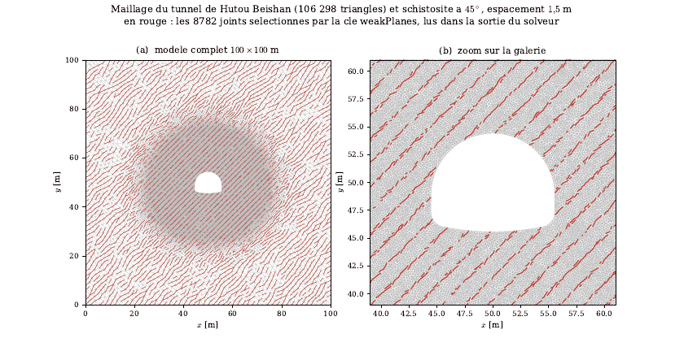

# tunnel_schisto : tunnel dans un massif lité (méthode de Lisjak)

## 1. Objet

Volet exploratoire du tunnel de Wang et al. (voir `tunnel_edz/`) : le même tunnel en fer à cheval, creusé dans un massif lité à 45°. Le modèle assemble les trois briques de Lisjak (thèse de Toronto 2013 ; Lisjak et al. 2014) : élasticité transversalement isotrope, loi cohésive directionnelle qui varie linéairement avec l'angle entre le joint et le litage, maillage à arêtes alignées sur le litage. Paramètres dans le plan du litage : ceux de Wang ; rapports d'anisotropie : argilite d'Opalinus (ft 0,246, c 0,111, G_I 0,057, G_II 0,286).

Question : comment le litage oriente-t-il l'EDZ, et l'arrêt des fissures sur les plans délaminés est-il physique ou un artefact du modèle (rapport de ténacités, 2D, maillage aligné, λ = 1) ?

## 2. Statut

| date | état |
|---|---|
| 1-2 septembre 2026 | bibliographie, revue « traversée du litage », un seul calcul de production (`tunnel_lisjak45_4h.cfg`, 4 h 11) |
| 2 septembre 2026 | suite de dix calculs préparée (`SUITE_solutions.md`), aucun lancé ; pendages 0° et 90° préparés, non lancés |

Étude exploratoire en cours, arrêtée à un calcul. La correction du contact du 7 octobre 2026 (`docs/rapport_guide/ENQUETE_CONTACT.md`) concerne directement ce type de calcul (FDEM 2D, tunnel, fragments en contact) : le calcul de production a tourné avec l'ancien contact, qui injectait de l'énergie dans le tunnel isotrope (`docs/rapport_guide/rejeu_tunnel_fix/RESULTATS.md`), et n'a pas été rejoué. La calibration de juillet n'intervient pas.

## 3. Résultat principal

Sources : rapport-guide (`r05c_tunnel.tex`, volet exploratoire) et `SUITE_solutions.md`.

- Contrôles élémentaires satisfaits : modules apparents à 0,13 %, rapport d'anisotropie du pic 1,94 (Lisjak : environ 1,9).
- Calcul de production (117 132 triangles) : EDZ en losange orientée par le litage, 31 % de joints rompus en moins que le témoin isotrope à champ corrélé ; profondeur endommagée 6,0 m le long du litage et 3,4 m en travers (rapport 1,77 contre 1,19 en isotrope).
- Aucune fissure ne traverse un plan délaminé, comme le prédit le critère de He et Hutchinson pour un rapport de ténacités de 0,057, 4,4 fois sous le seuil d'environ 1/4 à 90° (`REVUE_traversee_litage.md` §2).
- Réserves : un calcul, une graine, un pendage ; zone cohésive non résolue le long du litage (ℓ_cz = 179 mm pour des arêtes de 200 mm) ; convergence de 3,4 m aux reins, soit un effondrement.

## 4. Figures



Maillage du tunnel (106 298 triangles) et schistosité à 45° espacée de 1,5 m : en rouge, les 8 782 joints sélectionnés par la clé `weakPlanes`, lus dans la sortie du solveur (variante `tunnel_wp45.cfg`). Aperçu converti depuis `mesh_schisto45.pdf`. Aucune figure de résultat n'est archivée.

## 5. Contenu du dossier

| chemin | contenu |
|---|---|
| `BIBLIO_anisotropie_fdem.md` | bibliographie de l'anisotropie en FDEM (lignée Lisjak, Grasselli, Vietor), références vérifiées marquées |
| `_biblio_schisto_partiel_data.md` | données de roches métamorphiques foliées 2018-2026, résumés seulement, non vérifiées |
| `REVUE_traversee_litage.md` | arrêt des fissures sur les plans délaminés : théorie, mesures, observations in situ, solutions pour le code |
| `SUITE_solutions.md` | suite de dix calculs (S1 à S9), ordre, coût, verdicts attendus, outils |
| `tunnel_wp00/45/90.cfg` | schistosité par plans faibles parallèles (`weakPlanes`), maillage isotrope |
| `tunnel_lisjak00/45/90.cfg`, `*_4h.cfg` | méthode de Lisjak, trois pendages ; `_4h` = réglage à 4 h 30 (maillage t = 0,60 m, h = 0,20 m) |
| `S1_G*.cfg`, `S2_*.cfg`, `S3_lambda*.cfg`, `S4_*.cfg`, `S7_ramp024.cfg`, `S9a_muRes040.cfg` | suite « traversée du litage » : rapport de ténacités, résistance et ténacité découplées, λ, loi neutre, maillage seul, relâchement lent, frottement résiduel |
| `make_tunnel_bedded_mesh.py` | maillage à arêtes alignées sur le litage (brique 3 de Lisjak) |
| `plot_mesh.py`, `plot_all_meshes.py` | figures des maillages et des plans effectivement sélectionnés |
| `mesh_schisto45.pdf`, `mesh_bedded45.pdf`, `meshes_planche.pdf` | maillage à plans faibles, maillage lité, planche des maillages préparés |
| `tools/edz_sectors.py`, `joint_state_stats.py`, `tip_velocity.py` | profondeur d'EDZ par secteur, état des plans-frontières et traversées, vitesse de pointe |
| `run_lisjak_4h.ps1`, `run_solutions.ps1` | lancement séquentiel sous Windows (refusent de démarrer si un calcul tourne) |
| `biblio/` | article de Lisjak et al. 2014 (PDF) et texte de la thèse de Lisjak |

## 6. Rejouer

Depuis la racine du dépôt (le maillage est à générer ; paramètres du calcul de production dans l'en-tête de `tunnel_lisjak45_4h.cfg`) :

```sh
python3 tunnel_schisto/make_tunnel_bedded_mesh.py 100 100 0.20 18 1.8 45 0.60 24 meshes/tunnel_hs_bed45_t06.msh 1
build/rockim tunnel_schisto/tunnel_lisjak45_4h.cfg out_lisjak45_4h
python3 tunnel_schisto/tools/edz_sectors.py out_lisjak45_4h --dip 45
```

Les arguments de maillage reprennent l'exemple de `make_tunnel_bedded_mesh.py` avec t = 0,60 m et h = 0,20 m ; le journal de génération d'origine (`_bedded_gen.log`) n'est pas dans le dépôt, à vérifier avant usage. Pour la suite de solutions, sous Windows : `powershell -ExecutionPolicy Bypass -File tunnel_schisto/run_solutions.ps1 S4_ratios1 S4_isotrope_maillage_lite S1_G030 S3_lambda130`. Chapitre du rapport-guide : `docs/rapport_guide/sections/r05c_tunnel.tex`, sous-section « Volet exploratoire : tunnel dans un massif lité », dans [rapport_guide_rockim.pdf](../docs/rapport_guide/rapport_guide_rockim.pdf).
