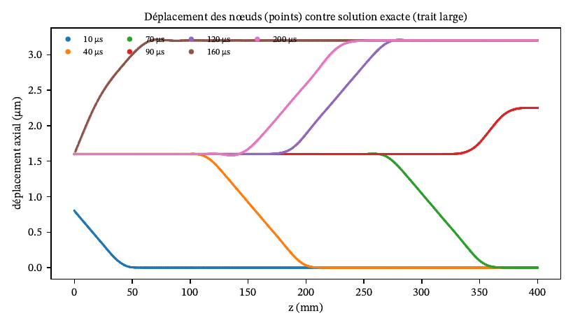

# Campagne V&V de rockim : bancs, decks et entrées

Ce dossier contient les bancs de la campagne décrite dans `docs/VV_campagne.md`. Chaque banc est
un dossier autonome qui génère ses maillages, écrit ses decks, lance rockim et compare les sorties
à sa référence avec des critères écrits avant le calcul.

La campagne a deux volets. La validation physique (P1 à P5) confronte rockim à des solutions exactes
et à des résultats théoriques sur des cas canoniques. La validation par benchmark (B1 à B9) reproduit
les résultats chiffrés d'articles publiés, pour comparer rockim aux autres codes FDEM. Elle a commencé
le 2026-10-03.

## Statut des bancs (2026-10-07)

| Banc | Objet | Référence | Dossier | Statut |
|---|---|---|---|---|
| P1.1 | onde de compression dans une barre ; balayage de la pénalité | d'Alembert | `V1_onde/` | fait le 2026-10-03 : fem3d passe ; fdem3d adaptatif passe sauf le bilan d'énergie ; fdem3d intrinsèque biaisé de −3 % sur la célérité |
| P1.2 | plaque trouée en 3D | Kirsch | `P1_elastique/` | banc prêt ; fumée du 2026-10-04 sur le maillage grossier (Kt à −0,40 % en fem3d) ; maillages fins à lancer |
| P1.3 | cube sous chargement biaxial, patch test | élasticité linéaire | `P1_elastique/` | banc prêt ; fumée du 2026-10-04 : erreur nodale 7,5·10⁻⁸ en fem3d et fdem3d |
| P2.1 | bloc glissant jusqu'à l'arrêt | L = v²/(2µg) (Xiang 2009, Fukuda 2020) | `P2_bloc/` | fait le 2026-10-04 : `contact = potential` passe (L à 1,7 % au plus) ; `penalty` échoue (le bloc bascule) |
| P2.2 | sphère sur un plan | Hertz (Johnson 1985) | `P2_sphere/` | banc prêt ; essai court : force filtrée à +4,6 %, enfoncement maximal à −3,6 % ; campagne à lancer |
| P3.1 | fissure pressurisée, sensibilité au maillage | Guo 2014 §2.4 ; mécanique linéaire de la rupture | `P3_fissure_guo/` | banc prêt ; fumée du 2026-10-04 ; campagne à lancer |
| P3.2 | énergie de fissuration | Gf × aire rompue | — | prévu |
| P3.3 | fissure en aile | Lisjak 2013 §3.4.3 ; quatre modèles de mécanique linéaire de la rupture | `P3_aile_lisjak/` | banc prêt ; essai de chaîne du 2026-10-04 ; campagne à lancer |
| P4.1 | flexion trois points | Guo 2014 ch. 3 ; théorie des poutres | `P4_essais_guo/` | banc prêt ; essai à blanc du 2026-10-04 ; campagne à lancer |
| P4.2 | essai brésilien | Guo 2014 ch. 3 ; Hondros | `P4_essais_guo/` | banc prêt ; essai à blanc du 2026-10-04 ; campagne à lancer |
| P4.3 | compression polyaxiale | Mohr-Coulomb | `bench_polyaxial` (suite) | fait, dans `tools/verify_suite.py` |
| P5 | sensibilités : maillage, vitesse de chargement, pénalité | protocole de Guo et Lisjak | `V1_onde/` | pénalité faite : c_eff/c = (1 + 1,24/pf)^(−1/2), prédiction tenue à 0,05 point |
| B1 | Guo 2014, §2.4 et chapitre 3 | valeurs de Solidity | `P3_fissure_guo/`, `P4_essais_guo/` | préparé avec P3.1, P4.1 et P4.2 |
| B2 | Lisjak 2013, fissure en aile | Y-Geo : σ1c = 7,0 MPa, branchement à 64° | `P3_aile_lisjak/` | préparé avec P3.3 |
| B3 | Fukuda et al. 2020, frottement et brésilien | Y-HFDEM 3D | `B_articles/` | étude de faisabilité seulement, non implémenté |
| B4 | AbuAisha et al. 2017, hydro-mécanique | Y-Geo | `B_articles/` | résultats antérieurs (`bench_abuaisha/`) ; re-run préparé, fumée du 2026-10-04 |
| B5 | Wang et al. 2024, tunnel | MultiFracS | `B_articles/` | résultats antérieurs (`tunnel_edz/`) ; re-run préparé, fumée du 2026-10-04 |
| B6 | Yan et al. 2023, UCS adaptatif | article | `B_articles/` | fait (`ucs_yan_adaptive` dans la suite) ; re-run préparé |
| B7 | Yang et al. 2025 et 2026, impact d'insert | Solidity | `B_articles/` | partiel ; re-run préparé, fumée du 2026-10-04 |
| B8 | Saksala 2011, impact d'un bouton | valeurs publiées | `B_impact_coupe/` | banc prêt ; fumée du 2026-10-04 (bouton plat : F_max à −14,7 %) |
| B9 | Heilman et al. 2024 et LeBaron 2023, coupe au cutter PDC 3D | HOSS et essai | `B_impact_coupe/` | banc prêt ; fumée du 2026-10-04 |

Les essais de fumée valident la chaîne de calcul sur des maillages grossiers ; leurs chiffres ne sont
pas des résultats. Le détail de chaque banc (problème, référence, critères, résultats) est dans son
`README.md` ; pour `V1_onde/` et `P2_bloc/`, il est dans `docs/VV_campagne.md`, sections II.1 et II.2.



Banc P1.1, fem3d à h = 2 mm : déplacement axial des nœuds (points) contre la solution exacte (trait
large) à sept instants. Figure vectorielle d'origine : `V1_onde/fig_profils.pdf`.

## Organisation

| Dossier | Banc | Référence | Solveurs |
|---|---|---|---|
| `V1_onde/` | P1.1 onde de compression dans une barre ; balayage de la pénalité | d'Alembert | fem3d, fdem3d |
| `P1_elastique/` | P1.2 Kirsch en 3D ; P1.3 cube biaxial (patch test) | élasticité linéaire | fem3d, fdem3d |
| `P2_bloc/` | P2.1 bloc glissant jusqu'à l'arrêt | L = v²/(2µg) (Xiang 2009, Fukuda 2020) | fdem3d |
| `P2_sphere/` | P2.2 sphère sur un plan | Hertz (Johnson 1985) | fdem3d |
| `P3_fissure_guo/` | P3.1 fissure pressurisée, sensibilité au maillage ; B1 | Guo 2014 §2.4 ; LEFM | fdem3d |
| `P3_aile_lisjak/` | P3.3 fissure en aile ; B2 | Lisjak 2013 §3.4.3 ; quatre modèles de LEFM | fdem 2D |
| `P4_essais_guo/` | P4.1 flexion trois points ; P4.2 brésilien ; B1 | Guo 2014 ch. 3 ; théorie des poutres, Hondros | fdem3d |
| `B_articles/` | B3 à B7 : AbuAisha 2017, tunnel de Wang 2024, UCS de Yan 2023, impact de Yang 2025 et 2026 ; faisabilité de Fukuda 2020 | valeurs publiées et résultats rockim antérieurs | fdem, fdem3d |
| `B_impact_coupe/` | benchmarks d'impact et de coupe tirés de la bibliographie (Aising, Saksala, études PDC, Labra et Rojek, LeBaron) ; B8 et B9 | valeurs publiées | fdem3d, fem3d, fdem |

Fichiers communs à la racine de `vv/` :

| Fichier | Rôle |
|---|---|
| `vvcommon.py` | objet `Job`, lancement d'un run, lecture des journaux, utilitaires communs |
| `run_queue.py` | file d'exécution de plusieurs bancs en parallèle (`--slots`, `--threads`) |
| `run_daemon.py` | lanceur de fond : exécute les bancs marqués d'un fichier `PRET`, puis leur analyse, et pose `FINI` ou `ECHEC` |

## Conventions

Chaque banc contient :

- un script `<id>.py` avec les actions `prepare`, `run`, `analyse` et `all`, et une fonction
  `JOBS(args)` qui renvoie la liste des runs (objets `Job` de `vvcommon.py`) ;
- les critères d'acceptation, en constantes du script, écrits avant le premier calcul ;
- un `README.md` : objectif, problème, référence et formules, mise en œuvre, métriques, critères,
  commande pour reproduire ;
- `resultats.json` et les figures `fig_*.pdf` (versionnées) et `fig_*.png` (aperçus, ignorés) ;
- `meshes/` (maillages générés, ignorés par git) et `out/` (sorties brutes, ignorées).

Les bancs n'utilisent que des clés existantes de rockim et ne modifient pas `src/`. Un run est
considéré comme fini quand son journal `rockim.log` contient la ligne `wall time` ; la file saute
les runs finis, ce qui permet de reprendre une campagne interrompue.

## Lancer

Un banc seul :

```bash
python3 vv/P2_bloc/p2_bloc.py all
```

Plusieurs bancs en parallèle, en respectant slots × fils ≤ nombre de cœurs :

```bash
python3 vv/run_queue.py P1_elastique P2_sphere P3_fissure_guo --slots 4 --threads 2
```

puis l'analyse de chaque banc (`python3 vv/<banc>/<id>.py analyse`). Le binaire par défaut est
`build_nofma/rockim` (Release, OpenMP de Homebrew, `-ffp-contract=off`).

En tâche de fond, après relecture d'un banc, poser un fichier `vv/<banc>/PRET` puis :

```bash
nohup python3 vv/run_daemon.py --slots 4 --threads 2 &
```
